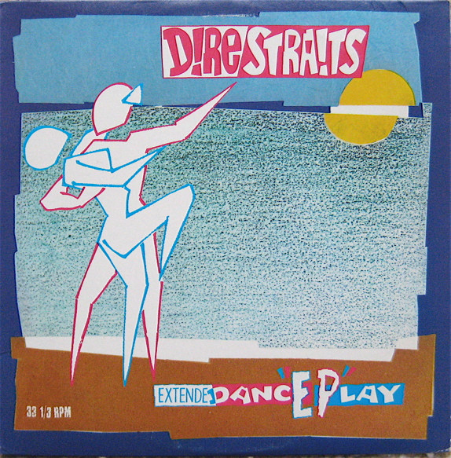

# ExtendeDancEPlay

By Dire Straits

## Album Data

[Discogs URL](https://www.discogs.com/release/1389361-Dire-Straits-ExtendeDancEPlay)

- Label: Warner Bros. Records
Warner Bros. Records
- Formats: Vinyl, 12", 33 ⅓ RPM, EP
- Genres: Rock, Pop Rock, Classic Rock
- Rating: 3.63
- Released: 1983
- Year: 1983
- Release ID: 1389361
- Media condition: 
- Sleeve condition: 
- Speed: 
- Weight: 
- Notes: 

## Album Tracks

| **Position** | **Title** | **Duration** |
|--------------|-----------|--------------|
| A1 | **Twisting By The Pool** | 3:30 |
| A2 | **Badges, Posters, Stickers, T-Shirts** | 4:53 |
| B1 | **Two Young Lovers** | 3:22 |
| B2 | **If I Had You** | 4:15 |

## Artist Roles

| **Name** | **Role** |
|----------|----------|
| **John Illsley** | Bass |
| **Terry Williams (3)** | Drums |
| **John Etchells** | Engineer |
| **Hal Lindes** | Guitar |
| **Bob Ludwig** | Lacquer Cut By |
| **Alan Clark** | Piano |
| **Mark Knopfler** | Producer, Written-By |
| **Mark Knopfler** | Vocals, Guitar |

