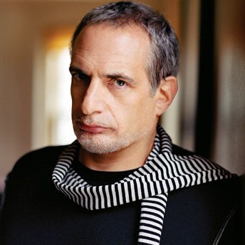

# Donald Fagen

## Artist Profile

Born in Passaic, New Jersey on 10 January 1948. Best known as the co-founder, lead singer and keyboardist of the band Steely Dan.

## Artist Links

- [https://www.facebook.com/DonaldFagenMusic](https://www.facebook.com/DonaldFagenMusic)
- [http://en.wikipedia.org/wiki/Donald_Fagen](http://en.wikipedia.org/wiki/Donald_Fagen)
- [http://www.imdb.com/name/nm0004907/](http://www.imdb.com/name/nm0004907/)

## See also

- [The Nightfly](The_Nightfly.md)
