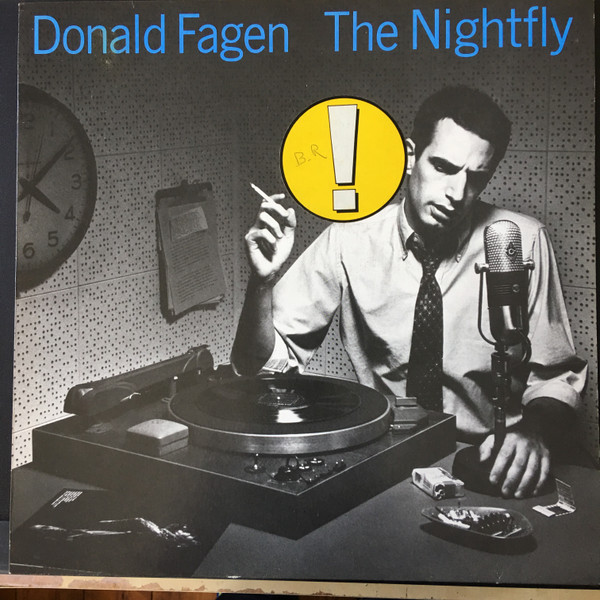

# The Nightfly

By Donald Fagen

## Album Data

[Discogs URL](https://www.discogs.com/release/1178973-Donald-Fagen-The-Nightfly)

- Label: Warner Bros. Records
Warner Bros. Records
- Formats: Vinyl, LP, Album, Stereo
- Genres: Jazz, Rock, Pop, Fusion, Pop Rock
- Rating: 4.38
- Released: 1982
- Year: 1982
- Release ID: 1178973
- Media condition: 
- Sleeve condition: 
- Speed: 
- Weight: 
- Notes: 

## Album Tracks

| **Position** | **Title** | **Duration** |
|--------------|-----------|--------------|
| A1 | **I.G.Y. (International Geophysical Year)** | 6:05 |
| A2 | **Green Flower Street** | 3:40 |
| A3 | **Ruby Baby** | 5:38 |
| A4 | **Maxine** | 3:50 |
| B1 | **New Frontier** | 6:23 |
| B2 | **The Nightfly** | 5:45 |
| B3 | **The Goodbye Look** | 4:47 |
| B4 | **Walk Between Raindrops** | 2:38 |

## Artist Roles

| **Name** | **Role** |
|----------|----------|
| **Donald Fagen** | Arranged By [Horns] |
| **Rob Mounsey** | Arranged By [Horns] |
| **George Delmerico** | Art Direction |
| **Daniel Lazerus** | Backing Vocals |
| **Frank Floyd** | Backing Vocals |
| **Gordon Grody** | Backing Vocals |
| **Leslie Miller** | Backing Vocals |
| **Starz Vanderlocket** | Backing Vocals |
| **Valerie Simpson** | Backing Vocals |
| **Zachary Sanders** | Backing Vocals |
| **Abraham Laboriel** | Bass |
| **Anthony Jackson** | Bass |
| **Chuck Rainey** | Bass |
| **Marcus Miller** | Bass |
| **Will Lee** | Bass |
| **Ed Greene (2)** | Drums |
| **James Gadson** | Drums |
| **Jeff Porcaro** | Drums |
| **Steve Jordan** | Drums |
| **Cheryl Smith** | Engineer [Assistant] |
| **Michael Morongell** | Engineer [Assistant] |
| **Robin Laine** | Engineer [Assistant] |
| **Wayne Yurgelin** | Engineer [Assistant] |
| **Roger Nichols** | Engineer [Chief] |
| **Bill Roach** | Engineer [Digital Maintenance, 3M] |
| **Jiri Donovsky** | Engineer [Digital Maintenance, 3M] |
| **Michael Morongell** | Engineer [Digital Maintenance, Soundworks] |
| **Wayne Yurgelin** | Engineer [Digital Maintenance, Soundworks] |
| **Daniel Lazerus** | Engineer [Overdub] |
| **Dave Bargeron** | Euphonium |
| **Randy Brecker** | Flugelhorn |
| **Dean Parks** | Guitar |
| **Hugh McCracken** | Guitar |
| **Larry Carlton** | Guitar |
| **Rick Derringer** | Guitar |
| **Steve Khan** | Guitar |
| **Hugh McCracken** | Harmonica |
| **Bob Ludwig** | Lacquer Cut By |
| **Donald Fagen** | Liner Notes |
| **Bob Ludwig** | Mastered By [Original Mastering, Masterdisk, N.Y.C.] |
| **Roger Nichols** | Percussion |
| **Starz Vanderlocket** | Percussion |
| **James Hamilton (5)** | Photography By |
| **Greg Phillinganes** | Piano |
| **Michael Omartian** | Piano |
| **Gary Katz** | Producer |
| **Dave Tofani** | Saxophone |
| **Michael Brecker** | Saxophone |
| **Ronnie Cuber** | Saxophone |
| **Roger Nichols** | Sequenced By, Percussion, Effects [Special Effects] |
| **Wendel II** | Sequenced By, Percussion, Effects [Special Effects] |
| **Gale Sasson** | Set Designer [Set Design And Construction] |
| **Vern Yenor** | Set Designer [Set Design And Construction] |
| **Greg Phillinganes** | Synthesizer |
| **Rob Mounsey** | Synthesizer |
| **Donald Fagen** | Synthesizer, Synth [Synth Blues Harp] |
| **Elliot Scheiner** | Tracking By, Mixed By [Mixdown] |
| **Dave Bargeron** | Trombone |
| **Randy Brecker** | Trumpet |

