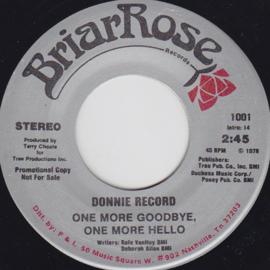

# One More Goodbye, One More Hello

By Donnie Record

## Album Data

[Discogs URL](https://www.discogs.com/release/4880058-Donnie-Record-One-More-Goodbye-One-More-Hello)

- Label: Briar Rose Records
- Formats: Vinyl, 7", 45 RPM, Promo
- Genres: Folk, World, & Country, Country
- Rating: 0
- Released: 1978
- Year: 1978
- Release ID: 4880058
- Media condition: 
- Sleeve condition: 
- Speed: 
- Weight: 
- Notes: 

## Album Tracks

| **Position** | **Title** | **Duration** |
|--------------|-----------|--------------|
| A | **One More Goodbye, One More Hello** |  |
| B | **One More Goodbye, One More Hello** |  |

## Artist Roles

| **Name** | **Role** |
|----------|----------|
| **Terry Choate** | Producer |
| **Deborah Allen** | Written-By |
| **Rafe Van Hoy** | Written-By |

