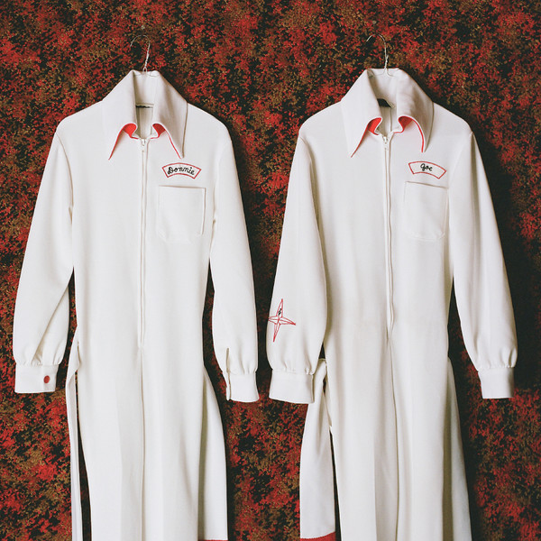

# Still Dreamin' Wild: The Lost Recordings 1979-81

By Donnie & Joe Emerson

## Album Data

[Discogs URL](https://www.discogs.com/release/6399111-Donnie-Joe-Emerson-Still-Dreamin-Wild-The-Lost-Recordings-1979-81)

- Label: Light In The Attic
- Formats: Vinyl, LP, Limited Edition
- Genres: Rock, Pop, Psychedelic Rock, Power Pop
- Rating: 4.26
- Released: 2014-06-20
- Year: 2014
- Release ID: 6399111
- Media condition: 
- Sleeve condition: 
- Speed: 
- Weight: 
- Notes: 

## Album Tracks

| **Position** | **Title** | **Duration** |
|--------------|-----------|--------------|
| A1 | **Overture** |  |
| A2 | **Don't Fight** |  |
| A3 | **Ride The Tide** |  |
| A4 | **One True Love** |  |
| A5 | **Something's Comin' Down** |  |
| A6 | **Everybody Knows It** |  |
| B1 | **Big Money** |  |
| B2 | **Ooh Baby Yeah** |  |
| B3 | **Stand By Love** |  |
| B4 | **Girl With The Rainbow Suds** |  |
| B5 | **Since You Been With Me** |  |
| B6 | **Don't Disguise The Way You Feel** |  |

