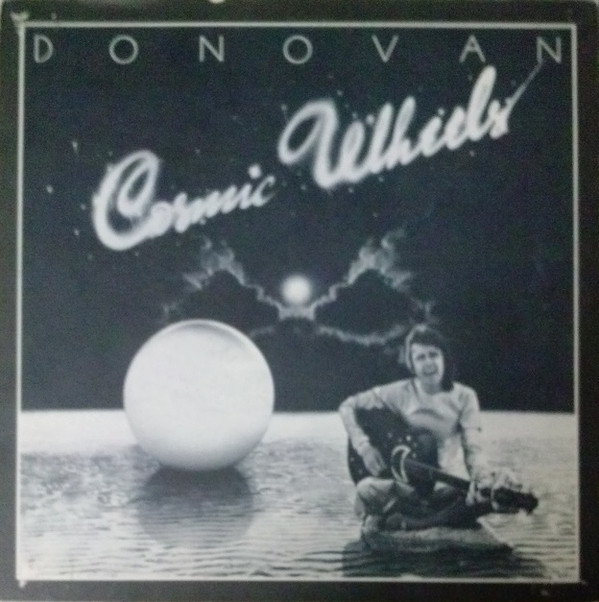

# Cosmic Wheels

By Donovan

## Album Data

[Discogs URL](https://www.discogs.com/release/6539224-Donovan-Cosmic-Wheels)

- Label: Epic
- Formats: Vinyl, LP, Album
- Genres: Rock, Folk, World, & Country, Folk Rock, Folk, Pop Rock
- Rating: 3.86
- Released: 1973
- Year: 1973
- Release ID: 6539224
- Media condition: 
- Sleeve condition: 
- Speed: 
- Weight: 
- Notes: 

## Album Tracks

| **Position** | **Title** | **Duration** |
|--------------|-----------|--------------|
| A1 | **Cosmic Wheels** | 4:00 |
| A2 | **Earth Sign Man** | 3:55 |
| A3 | **Sleep** | 4:45 |
| A4 | **Maria Magenta** | 2:10 |
| A5 | **Wild Witch Lady** | 4:20 |
| B1 | **The Music Makers** | 4:25 |
| B2 | **The Intergalactic Laxative** | 2:50 |
| B3 | **I Like You** | 5:10 |
| B4 | **Only The Blues** | 3:10 |
| B5 | **Appearances** | 3:36 |

## Artist Roles

| **Name** | **Role** |
|----------|----------|
| **Donovan Phillips Leitch** | Composed By |
| **Donovan** | Design [Cover] |
| **John Kosh** | Design [Cover] |
| **Mike Bobak** | Engineer |
| **Lee Hulko** | Mastered By [Runout Etch] |
| **Tony Evans (8)** | Photography By |
| **Donovan** | Producer |
| **Michael Peter Hayes** | Producer |

