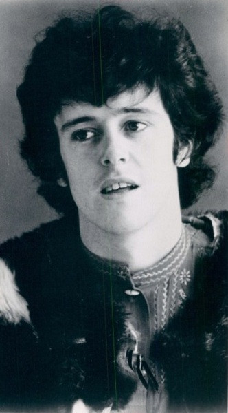

# Donovan

## Artist Profile

Scottish singer, songwriter and guitarist (b.10-May-1946, Glasgow). 

Was in a relationship with American model Enid Karl and they had two children: actor-musician Donovan Leitch in 1967 and actress Ione Skye in 1970. He married Linda Lawrence in October 1970. They have two children together, Astrella Celeste and Oriole. He is also the stepfather of Brian Jones' and Linda Lawrence's son, Julian Jones, also known as Julian Brian (Jones) Leitch.

Donovan was inducted into the Rock and Roll Hall of Fame in 2012 and the Songwriters Hall of Fame in 2014.
 
For any credits containing a variation of Donovan’s surname “Leitch” please use Donovan Phillips Leitch.
Not to be confused with his son Donovan Leitch.

## Artist Links

- [https://donovan.ie/](https://donovan.ie/)
- [https://www.facebook.com/DonovanOfficial](https://www.facebook.com/DonovanOfficial)
- [https://myspace.com/donovanofficial](https://myspace.com/donovanofficial)
- [https://en.wikipedia.org/wiki/Donovan](https://en.wikipedia.org/wiki/Donovan)
- [http://donovan-unofficial.com/](http://donovan-unofficial.com/)

## See also

- [A Gift From A Flower To A Garden](A_Gift_From_A_Flower_To_A_Garden.md)
- [Cosmic Wheels](Cosmic_Wheels.md)
- [Sunshine Superman](Sunshine_Superman.md)
- [To Susan On The West Coast Waiting / Atlantis](To_Susan_On_The_West_Coast_Waiting_-_Atlantis.md)
