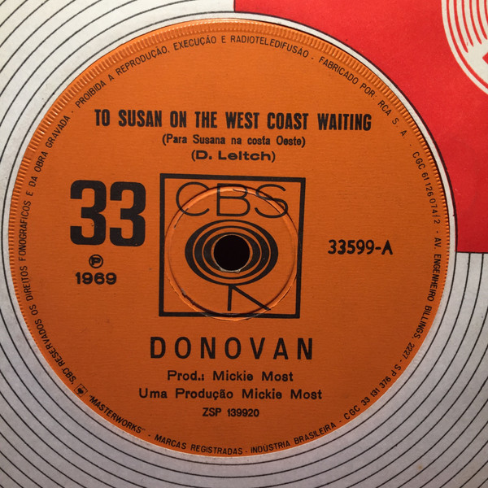

# To Susan On The West Coast Waiting / Atlantis

By Donovan

## Album Data

[Discogs URL](https://www.discogs.com/release/469690-Donovan-To-Susan-On-The-West-Coast-Waiting-Atlantis)

- Label: Epic
- Formats: Vinyl, 7", 45 RPM, Single, Styrene, Mono
- Genres: Rock, Psychedelic Rock
- Rating: 4.37
- Released: 1969-02-00
- Year: 1969
- Release ID: 469690
- Media condition: 
- Sleeve condition: 
- Speed: 
- Weight: 
- Notes: 

## Album Tracks

| **Position** | **Title** | **Duration** |
|--------------|-----------|--------------|
| A | **To Susan On The West Coast Waiting** | 3:13 |
| B | **Atlantis** | 4:58 |

## Artist Roles

| **Name** | **Role** |
|----------|----------|
| **Mickie Most** | Producer |
| **Donovan Phillips Leitch** | Written-By |

