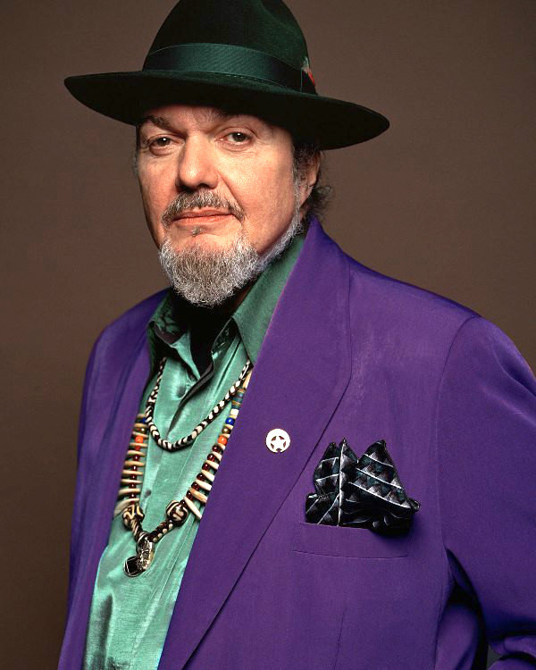

# Dr. John

## Artist Profile

Malcolm John Rebennack (born November 20, 1941, New Orleans, Louisiana, USA – died June 6, 2019), better known by his stage name Dr. John, was an American singer and songwriter. His music combines blues, pop, jazz, boogie woogie and rock and roll.

Rebennack began playing the piano at the age of six and, as he grew up, he became strongly influenced by the style of Roy Byrd (aka Professor Longhair). He immersed himself in the music and voodoo cultures of New Orleans, where he became known as Mac Rebennack, playing the organ in strip-clubs with 'make-up' bands in the French Quarter.

However, it was as a session guitarist with John Vincent's Ace Records that gave him his first break, around 1957. He worked with the New Orleans R&B session crew at Crescent City's 'Cosimo V. Matassa' studio and with an 'All For One' co-operative formed by Harold Battiste- cutting "Storm Warning" (Rex, 1957) and singles on Ace, Rex and AFO (an acronym of All For One) .

Rebennack then moved to California in 1962 with Battiste's crew, where they played on Sam Cooke's final recording session. Rebennack subsequently undertook a lot of session work around LA (appearing briefly for a "Freak Out!" album session with Frank Zappa) and developed his 'Mardi Gras' persona of "Dr. John Creaux, The Night Tripper" with Battiste's help, assembling the "Gris-Gris" album whilst sessioning for Sonny &amp; Cher.

His drawled and ponderous style, tinged with a husky Southern Comfort delivery, caught the mood of the moment upon the album's release in 1968 giving him the commercial freedom to explore the many facets of the Louisiana blues and Memphis funk cultures in following releases. His recordings have been supported by such alumni as Clapton, Jagger, Allen Toussaint, The Meters, Jerry Wexler and Mike Bloomfield. He had a top-ten hit with "Right Place, Wrong Time", and he appeared in the Martin Scorsese film The Last Waltz (1978).

Unexpectedly passed away of a sudden, massive heart attack on June 6, 2019.

## Artist Links

- [https://en.wikipedia.org/wiki/Dr._John](https://en.wikipedia.org/wiki/Dr._John)
- [http://www.nitetripper.com](http://www.nitetripper.com)
- [http://www.myspace.com/drjohnthenitetripper](http://www.myspace.com/drjohnthenitetripper)
- [http://en.wikipedia.org/wiki/Dr_John](http://en.wikipedia.org/wiki/Dr_John)
- [https://twitter.com/akadrjohn](https://twitter.com/akadrjohn)
- [https://www.facebook.com/DrJohn/](https://www.facebook.com/DrJohn/)

## See also

- [In The Right Place](In_The_Right_Place.md)
