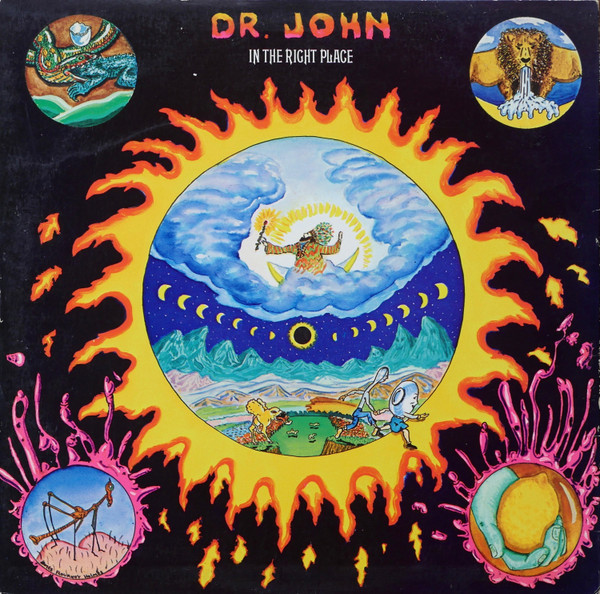

# In The Right Place

By Dr. John

## Album Data

[Discogs URL](https://www.discogs.com/release/554882-Dr-John-In-The-Right-Place)

- Label: ATCO Records
- Formats: Vinyl, LP, Album, Stereo
- Genres: Funk / Soul, Bayou Funk, Soul, Funk
- Rating: 4.36
- Released: 1973
- Year: 1973
- Release ID: 554882
- Media condition: 
- Sleeve condition: 
- Speed: 
- Weight: 
- Notes: 

## Album Tracks

| **Position** | **Title** | **Duration** |
|--------------|-----------|--------------|
| A1 | **Right Place Wrong Time** | 2:50 |
| A2 | **Same Old Same Old** | 2:39 |
| A3 | **Just The Same** | 2:49 |
| A4 | **Qualified** | 4:46 |
| A5 | **Traveling Mood** | 3:03 |
| A6 | **Peace Brother Peace** | 2:47 |
| B1 | **Life** | 2:29 |
| B2 | **Such A Night** | 2:55 |
| B3 | **Shoo Fly Marches On** | 3:15 |
| B4 | **I Been Hoodood** | 3:12 |
| B5 | **Cold Cold Cold** | 2:37 |

## Artist Roles

| **Name** | **Role** |
|----------|----------|
| **The Meters** | Backing Band [Rhythm] |
| **Jessica Smith** | Backing Vocals |
| **Robbie Montgomery** | Backing Vocals |
| **George Porter, Jr.** | Bass |
| **James Flournoy Holmes** | Design, Painting |
| **Joseph Modeliste** | Drums |
| **Karl Richardson** | Engineer |
| **David Michael Holmes** | Graphics [Graphic Coordinator] |
| **Leo Nocentelli** | Lead Guitar |
| **Allen Toussaint** | Mixed By [Re-mixed By] |
| **Arif Mardin** | Mixed By [Re-mixed By] |
| **Jimmy Douglass** | Mixed By [Re-mixed By] |
| **Art Neville** | Organ |
| **Allen Toussaint** | Producer, Arranged By, Piano, Electric Piano, Acoustic Guitar, Congas, Tambourine, Backing Vocals, Conductor |
| **Gary Brown (2)** | Saxophone |
| **Mac Rebennack** | Vocals, Backing Vocals |

