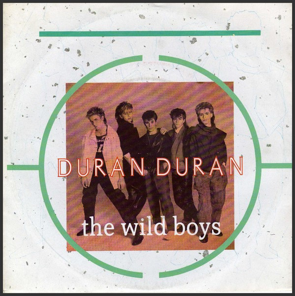

# The Wild Boys

By Duran Duran

## Album Data

[Discogs URL](https://www.discogs.com/release/1264409-Duran-Duran-The-Wild-Boys)

- Label: Capitol Records
Capitol Records
- Formats: Vinyl, 7", 45 RPM, Single, Stereo
- Genres: Electronic, Rock, Pop Rock, Synth-pop
- Rating: 4.07
- Released: 1984
- Year: 1984
- Release ID: 1264409
- Media condition: 
- Sleeve condition: 
- Speed: 
- Weight: 
- Notes: 

## Album Tracks

| **Position** | **Title** | **Duration** |
|--------------|-----------|--------------|
| A | **The Wild Boys** | 4:14 |
| B | **(I'm Looking For) Cracks In The Pavement** | 4:00 |

## Artist Roles

| **Name** | **Role** |
|----------|----------|
| **Francesco Scavullo** | Photography By [Front Photograph] |
| **Assorted Images** | Sleeve [Produced By] |
| **Duran Duran** | Written-By |

