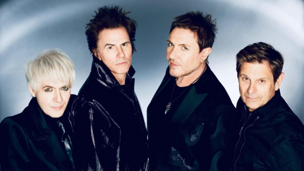

# Duran Duran

## Artist Profile

UK pop, new wave, and synth pop group founded in Birmingham, England in 1978. They have sold over 100 million records.

## Artist Links

- [http://duranduran.warnereprise.com](http://duranduran.warnereprise.com)
- [http://www.facebook.com/duranduran](http://www.facebook.com/duranduran)
- [http://www.instagram.com/duranduran](http://www.instagram.com/duranduran)
- 
- [http://musicianbio.org/duran-duran](http://musicianbio.org/duran-duran)
- [http://www.musicianguide.com/biographies/1608003860/Duran-Duran.html](http://www.musicianguide.com/biographies/1608003860/Duran-Duran.html)
- [http://myspace.com/duranduran](http://myspace.com/duranduran)
- 
- [http://duranduranofficial.tumblr.com](http://duranduranofficial.tumblr.com)
- [http://twitter.com/duranduran](http://twitter.com/duranduran)
- [http://en.wikipedia.org/wiki/Duran_Duran](http://en.wikipedia.org/wiki/Duran_Duran)
- [http://www.youtube.com/duranduran](http://www.youtube.com/duranduran)
- 
- [http://duranarchive.com](http://duranarchive.com)
- [http://www.duranasty.com](http://www.duranasty.com)
- [http://duranduranmusic.com](http://duranduranmusic.com)
- [http://duranduran.fandom.com/wiki/Duran_Duran](http://duranduran.fandom.com/wiki/Duran_Duran)
- [http://duranduranmusic.com](http://duranduranmusic.com)

## See also

- [The Wild Boys](The_Wild_Boys.md)
