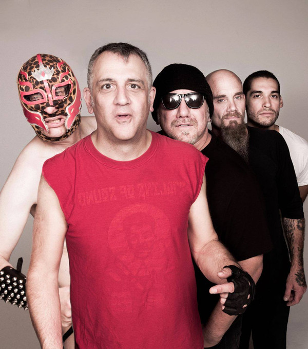

# Dwarves

## Artist Profile

American punk band formed in Chicago, Illinois in the mid-1980s as "The Suburban Nightmare". 
Singer Blag Dahlia (aka Paul Cafaro) and guitarist HeWhoCannotBeNamed (aka Peter Konicek) have always been the two core members of the group. The lineup has shifted around them.

## Artist Links

- [http://www.thedwarves.com/](http://www.thedwarves.com/)
- [https://www.facebook.com/pages/The-Dwarves/339745519075](https://www.facebook.com/pages/The-Dwarves/339745519075)
- [https://twitter.com/thedwarvesband](https://twitter.com/thedwarvesband)
- [http://www.myspace.com/thedwarves](http://www.myspace.com/thedwarves)
- [http://en.wikipedia.org/wiki/Dwarves_(band)](http://en.wikipedia.org/wiki/Dwarves_(band))
- [http://theconnextion.com/thedwarves/thedwarves_index.cfm](http://theconnextion.com/thedwarves/thedwarves_index.cfm)
- [http://www.dwarves.de/vtexte/Home.htm](http://www.dwarves.de/vtexte/Home.htm)
- [http://recordcollectorsoftheworldunite.com/artist/dwarves/](http://recordcollectorsoftheworldunite.com/artist/dwarves/)

## See also

- [Invented Rock & Roll](Invented_Rock_and_Roll.md)
