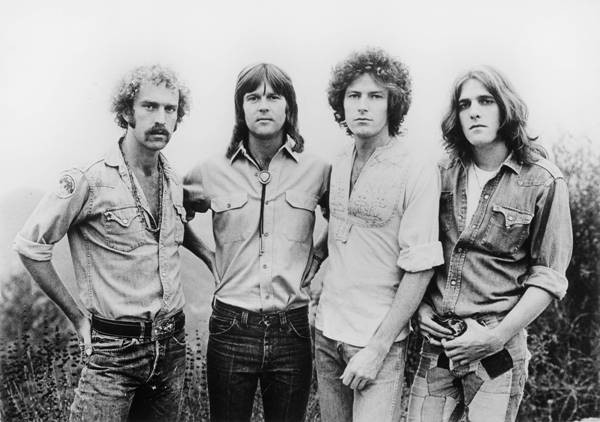

# Eagles

## Artist Profile

American rock band founded in 1971 by Glenn Frey (guitar), Bernie Leadon (banjo, mandolin, electric guitar, acoustic guitar), Randy Meisner (bass) and Don Henley (drums).

Don Henley: drums, percussion, vocals
Timothy B. Schmit: bass, vocals
Joe Walsh: guitars, organ, vocals

Former members: Bernie Leadon, Randy Meisner, Don Felder, Glenn Frey

Inducted into the Rock And Roll Hall of Fame in 1998 (Performer).

## Artist Links

- [https://www.eagles.com/](https://www.eagles.com/)
- [https://en.wikipedia.org/wiki/Eagles_%28band%29](https://en.wikipedia.org/wiki/Eagles_%28band%29)
- [https://www.last.fm/music/Eagles](https://www.last.fm/music/Eagles)
- [https://www.facebook.com/EaglesBand?rf=111080402249086](https://www.facebook.com/EaglesBand?rf=111080402249086)
- [https://myspace.com/eaglesmusic](https://myspace.com/eaglesmusic)
- [https://www.youtube.com/channel/UC49r4GNHHpc-eQ9hmD2Rg6A](https://www.youtube.com/channel/UC49r4GNHHpc-eQ9hmD2Rg6A)

## See also

- [Desperado](Desperado.md)
- [Hotel California](Hotel_California.md)
- [On The Border](On_The_Border.md)
