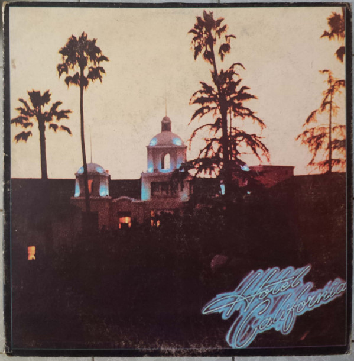

# Hotel California

By Eagles

## Album Data

[Discogs URL](https://www.discogs.com/release/6623165-Eagles-Hotel-California)

- Label: Asylum Records
Rhino Records (2)
- Formats: Vinyl, LP, Album, Reissue, Stereo
- Genres: Rock, Country Rock
- Rating: 4.56
- Released: 2014-12-19
- Year: 1976
- Release ID: 6623165
- Media condition: 
- Sleeve condition: 
- Speed: 
- Weight: 
- Notes: 

## Album Tracks

| **Position** | **Title** | **Duration** |
|--------------|-----------|--------------|
| A1 | **Hotel California** | 6:30 |
| A2 | **New Kid In Town** | 5:04 |
| A3 | **Life In The Fast Lane** | 4:46 |
| A4 | **Wasted Time** | 4:55 |
| B1 | **Wasted Time (Reprise)** | 1:22 |
| B2 | **Victim Of Love** | 4:11 |
| B3 | **Pretty Maids All In A Row** | 4:05 |
| B4 | **Try And Love Again** | 5:10 |
| B5 | **The Last Resort** | 7:25 |

## Artist Roles

| **Name** | **Role** |
|----------|----------|
| **Don Henley** | Art Direction |
| **John Kosh** | Art Direction |
| **John Kosh** | Artwork [Graphics] |
| **Norman Seeff** | Artwork [Poster] |
| **Allan Blazek** | Engineer |
| **Bill Szymczyk** | Engineer |
| **Bruce Hensal** | Engineer |
| **Ed Mashal** | Engineer |
| **Bernie Grundman** | Mastered By |
| **David Alexander (5)** | Photography By [Cover] |
| **Bill Szymczyk** | Producer, Mixed By |
| **Randy Meisner** | Vocals, Bass, Guitarrón |
| **Don Henley** | Vocals, Drums, Percussion |
| **Glenn Frey** | Vocals, Guitar, Keyboards |
| **Joe Walsh** | Vocals, Guitar, Keyboards |
| **Don Felder** | Vocals, Guitar, Slide Guitar |

