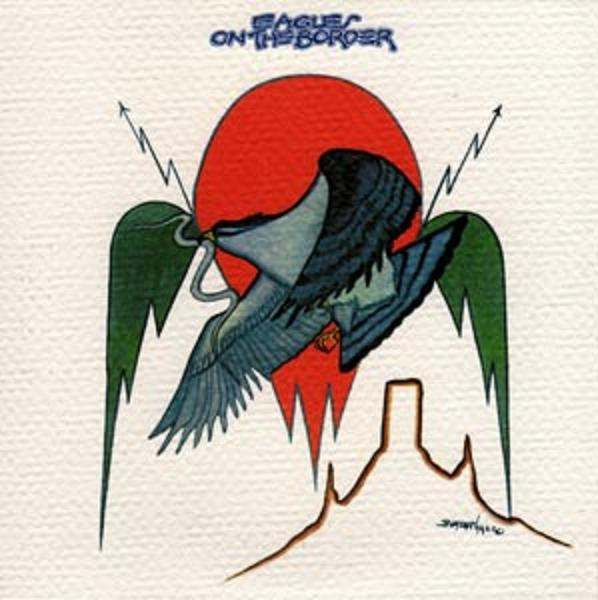

# On The Border

By Eagles

## Album Data

[Discogs URL](https://www.discogs.com/release/4401855-Eagles-On-The-Border)

- Label: Asylum Records
- Formats: Vinyl, LP, Album, Stereo
- Genres: Rock, Country Rock, Pop Rock
- Rating: 3.88
- Released: 1974-03-22
- Year: 1974
- Release ID: 4401855
- Media condition: 
- Sleeve condition: 
- Speed: 
- Weight: 
- Notes: 

## Album Tracks

| **Position** | **Title** | **Duration** |
|--------------|-----------|--------------|
| A1 | **Already Gone** | 4:13 |
| A2 | **You Never Cry Like A Lover** | 4:02 |
| A3 | **Midnight Flyer** | 3:58 |
| A4 | **My Man** | 3:30 |
| A5 | **On The Border** | 4:28 |
| B1 | **James Dean** | 3:36 |
| B2 | **Ol' '55** | 4:22 |
| B3 | **Is It True?** | 3:14 |
| B4 | **Good Day In Hell** | 4:27 |
| B5 | **Best Of My Love** | 4:35 |

## Artist Roles

| **Name** | **Role** |
|----------|----------|
| **Gary Burden** | Art Direction, Design |
| **R. Twerk & Co.** | Art Direction, Design |
| **Don Felder** | Electric Guitar |
| **Rob Thaer** | Engineer [Assisted By, At Olympic Studios] |
| **Allan Blazek** | Engineer [Assisted By, At The Record Plant] |
| **Gary Ladinsky** | Engineer [Assisted By, At The Record Plant] |
| **Bill Szymczyk** | Engineer [Remix Engineer] |
| **Lee Hulko** | Lacquer Cut By |
| **Rick Griffin (2)** | Lettering |
| **Beatian Yazz** | Painting [Cover Painting] |
| **Don Felder** | Performer [The Eagles Are, Late Arrival] |
| **Bernie Leadon** | Performer [The Eagles Are] |
| **Don Henley** | Performer [The Eagles Are] |
| **Glenn Frey** | Performer [The Eagles Are] |
| **Randy Meisner** | Performer [The Eagles Are] |
| **Henry Diltz** | Photography By |
| **Bill Szymczyk** | Producer, Engineer |
| **Glyn Johns** | Producer, Engineer |
| **Randy Meisner** | Vocals, Bass |
| **Don Henley** | Vocals, Drums |
| **Bernie Leadon** | Vocals, Guitar, Banjo, Steel Guitar |
| **Glenn Frey** | Vocals, Guitar, Piano |

