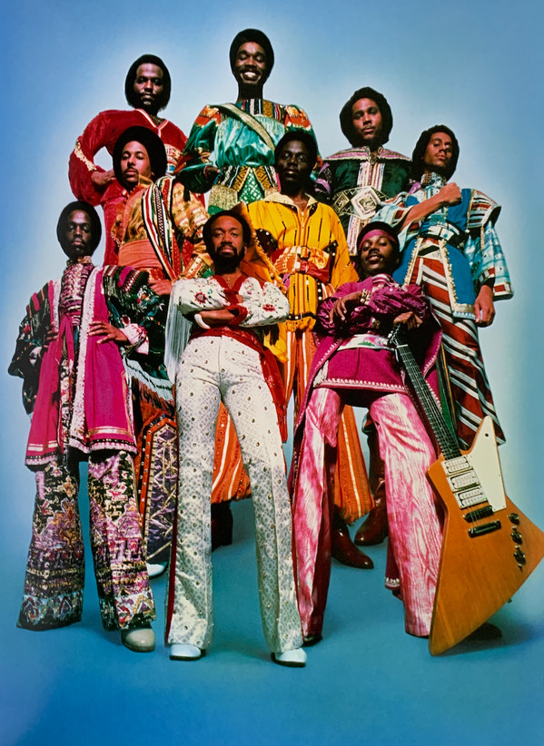

# Earth, Wind & Fire

## Artist Profile

Soul funk band.

Founded in Chicago, Illinois, in 1970 by Maurice White.
They have sold over 90 million units worldwide.
Inducted into Rock And Roll Hall of Fame in 2000 (Performer).

## Artist Links

- [https://www.earthwindandfire.com/](https://www.earthwindandfire.com/)
- [https://www.facebook.com/EarthWindandFire/](https://www.facebook.com/EarthWindandFire/)
- [https://twitter.com/EarthWindFire](https://twitter.com/EarthWindFire)
- [https://instagram.com/earthwindandfire](https://instagram.com/earthwindandfire)
- [https://myspace.com/earthwindandfire](https://myspace.com/earthwindandfire)
- [https://en.wikipedia.org/wiki/Earth,_Wind_%26_Fire](https://en.wikipedia.org/wiki/Earth,_Wind_%26_Fire)
- [https://www.imdb.com/name/nm0247451/](https://www.imdb.com/name/nm0247451/)
- [https://www.whosampled.com/Earth,-Wind-%26-Fire/](https://www.whosampled.com/Earth,-Wind-%26-Fire/)
- [https://www.youtube.com/user/earthwindandfire](https://www.youtube.com/user/earthwindandfire)
- [https://www.youtube.com/user/EarthWindandFireVEVO](https://www.youtube.com/user/EarthWindandFireVEVO)
- [https://vimeo.com/earthwindandfire](https://vimeo.com/earthwindandfire)

## See also

- [The Best Of Earth Wind & Fire Vol. I](The_Best_Of_Earth_Wind_and_Fire_Vol_I.md)
