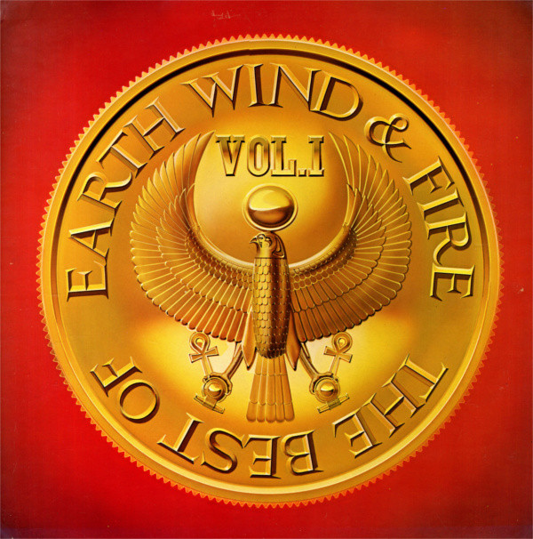

# The Best Of Earth Wind & Fire Vol. I

By Earth, Wind & Fire

## Album Data

[Discogs URL](https://www.discogs.com/release/670301-Earth-Wind-Fire-The-Best-Of-Earth-Wind-Fire-Vol-I)

- Label: ARC (3)
Columbia
ARC (3)
Columbia
- Formats: Vinyl, LP, Compilation, Stereo
- Genres: Funk / Soul, Soul, Funk, Disco
- Rating: 4.16
- Released: 1978
- Year: 1978
- Release ID: 670301
- Media condition: 
- Sleeve condition: 
- Speed: 
- Weight: 
- Notes: 

## Album Tracks

| **Position** | **Title** | **Duration** |
|--------------|-----------|--------------|
| A1 | **Got To Get You Into My Life** | 4:03 |
| A2 | **Fantasy** | 3:46 |
| A3 | **Can't Hide Love** | 4:11 |
| A4 | **Love Music** | 3:55 |
| A5 | **Getaway** | 3:46 |
| B1 | **That's The Way Of The World** | 5:47 |
| B2 | **September** | 3:37 |
| B3 | **Shining Star** | 2:50 |
| B4 | **Reasons** | 5:01 |
| B5 | **Singasong** | 3:23 |

## Artist Roles

| **Name** | **Role** |
|----------|----------|
| **Shusei Nagaoka** | Artwork [Cover] |
| **Charles Stepney** | Co-producer |
| **Bruce Talamon** | Photography By |
| **Don Hunstein** | Photography By |
| **Don Myrick** | Photography By |
| **Guy Crowder** | Photography By |
| **James Fee** | Photography By |
| **Johnny Graham** | Photography By |
| **Lee Lawrence (2)** | Photography By |
| **Nadine Talamon** | Photography By |
| **Maurice White** | Producer |

