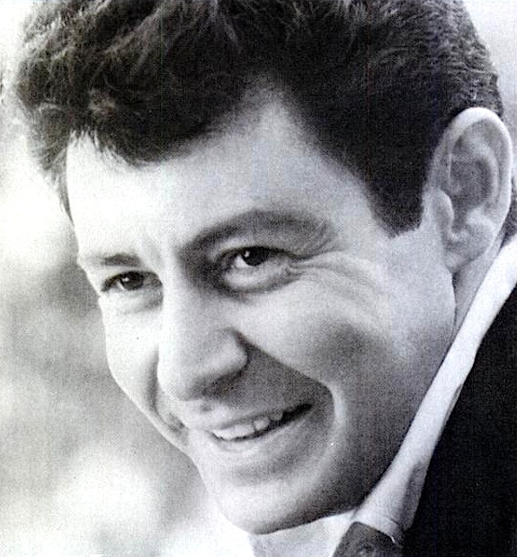

# Eddie Fisher

## Artist Profile

Eddie Fisher (born August 10, 1928, Philadelphia, Pennsylvania, USA - died September 22, 2010, Berkley, California, USA) was an American singer and entertainer who was popular in the 1950s, selling millions of records and having his own TV show. He was married five times including: Debbie Reynolds from 1955 until their divorce in 1959, with whom he had two children Carrie Fisher and Todd Fisher; Elizabeth Taylor from 1959 until their divorce in 1964; Connie Stevens from 1967 until their divorce in 1969, with whom he had two children Joely Fisher and Tricia Leigh Fisher. 

## Artist Links

- [http://en.wikipedia.org/wiki/Eddie_Fisher_%28singer%29](http://en.wikipedia.org/wiki/Eddie_Fisher_%28singer%29)

## See also

- [I Need You Now / Heaven Was Never Like This](I_Need_You_Now_-_Heaven_Was_Never_Like_This.md)
