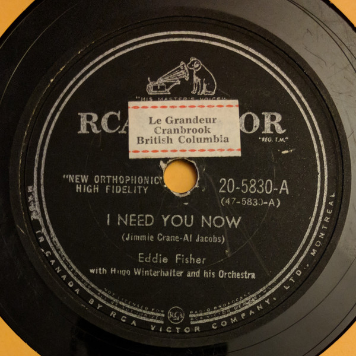

# I Need You Now / Heaven Was Never Like This

By Eddie Fisher

## Album Data

[Discogs URL](https://www.discogs.com/release/3065717-Eddie-Fisher-I-Need-You-Now-Heaven-Was-Never-Like-This)

- Label: RCA Victor
- Formats: Vinyl, 7", Single, 45 RPM
- Genres: Pop, Vocal
- Rating: 3.43
- Released: 1954
- Year: 1954
- Release ID: 3065717
- Media condition: 
- Sleeve condition: 
- Speed: 
- Weight: 
- Notes: 

## Album Tracks

| **Position** | **Title** | **Duration** |
|--------------|-----------|--------------|
| A | **I Need You Now** |  |
| B | **Heaven Was Never Like This** |  |

## Artist Roles

| **Name** | **Role** |
|----------|----------|
| **Hugo Winterhalter Orchestra** | Featuring [With] |

