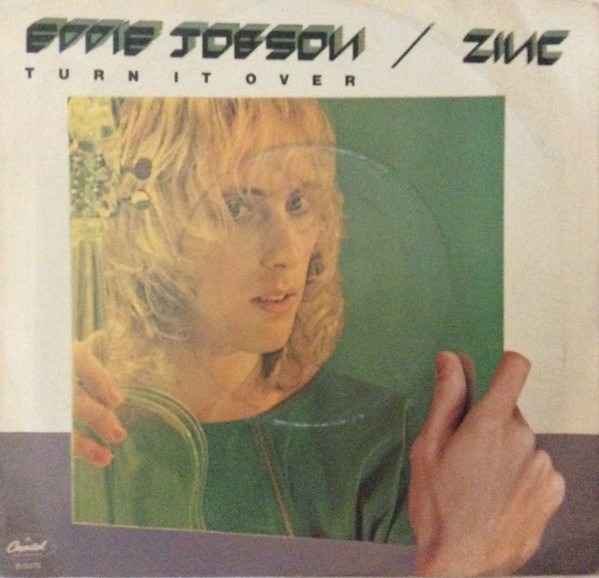

# Turn It Over

By Eddie Jobson

## Album Data

[Discogs URL](https://www.discogs.com/release/8167476-Eddie-Jobson-Zinc-Turn-It-Over)

- Label: Capitol Records
- Formats: Vinyl, 7", 45 RPM
- Genres: Rock, Prog Rock
- Rating: 5
- Released: 1983
- Year: 1983
- Release ID: 8167476
- Media condition: 
- Sleeve condition: 
- Speed: 
- Weight: 
- Notes: 

## Album Tracks

| **Position** | **Title** | **Duration** |
|--------------|-----------|--------------|
| A | **Turn It Over (Residential Mix)** | 5:08 |
| B | **Turn It Over** | 3:59 |

## Artist Roles

| **Name** | **Role** |
|----------|----------|
| **Cary Sharaf El Din** | Guitar [Uncredited] |
| **Wally Traugott** | Lacquer Cut By |
| **Eddie Jobson** | Producer, Written-By |

