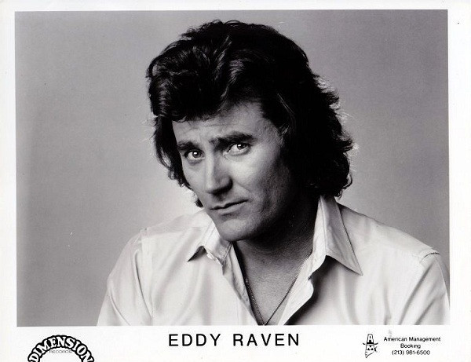

# Eddy Raven

## Artist Profile

American cajun-influenced country singer and songwriter, born August 19, 1944 in Lafayette, Louisiana.

## Artist Links

- [http://www.eddyraven.com/](http://www.eddyraven.com/)
- [https://www.oldies.com/artist-view/Eddy-Raven.html](https://www.oldies.com/artist-view/Eddy-Raven.html)
- [https://en.wikipedia.org/wiki/Eddy_Raven](https://en.wikipedia.org/wiki/Eddy_Raven)
- [https://soundcloud.com/eddy-raven](https://soundcloud.com/eddy-raven)
- [http://repertoire.bmi.com/Catalog.aspx?detail=writerid&page=1&fromrow=1&torow=25&keyid=121691&subid=0](http://repertoire.bmi.com/Catalog.aspx?detail=writerid&page=1&fromrow=1&torow=25&keyid=121691&subid=0)
- [https://www.ascap.com/repertory#ace/writer/11056148/FUTCH%20EDWARD%20GARVIN](https://www.ascap.com/repertory#ace/writer/11056148/FUTCH%20EDWARD%20GARVIN)

## See also

- [Sooner Or Later](Sooner_Or_Later.md)
