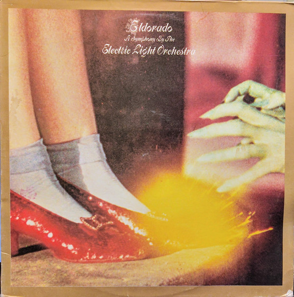

# Eldorado - A Symphony By The Electric Light Orchestra

By Electric Light Orchestra

## Album Data

[Discogs URL](https://www.discogs.com/release/7865423-Electric-Light-Orchestra-Eldorado-A-Symphony-By-The-Electric-Light-Orchestra)

- Label: Sony Music
Epic
Legacy
- Formats: Vinyl, LP, Album, Limited Edition, Numbered, Reissue
- Genres: Rock, Symphonic Rock, Classic Rock
- Rating: 4.5
- Released: 2015-12-18
- Year: 1974
- Release ID: 7865423
- Media condition: 
- Sleeve condition: 
- Speed: 
- Weight: 
- Notes: 

## Album Tracks

| **Position** | **Title** | **Duration** |
|--------------|-----------|--------------|
| A1 | **Eldorado Overture** | 2:12 |
| A2 | **Can't Get It Out Of My Head** | 4:26 |
| A3 | **Boy Blue** | 5:17 |
| A4 | **Laredo Tornado** | 5:26 |
| A5 | **Poor Boy (The Greenwood)** | 2:56 |
| B1 | **Mister Kingdom** | 5:50 |
| B2 | **Nobody's Child** | 3:40 |
| B3 | **Illusions In G Major** | 2:36 |
| B4 | **Eldorado** | 5:20 |
| B5 | **Eldorado Finale** | 1:20 |

## Artist Roles

| **Name** | **Role** |
|----------|----------|
| **Jeff Lynne** | Arranged By |
| **Louis Clark** | Arranged By |
| **Richard Tandy** | Arranged By |
| **John Williams (30)** | Art Direction |
| **Michael d'Albuquerque** | Bass |
| **Hugh McDowell** | Cello |
| **Mike Edwards (6)** | Cello |
| **Louis Clark** | Conductor [Orchestra] |
| **John Kehe** | Design |
| **Bev Bevan** | Drums, Percussion |
| **Mike Pela** | Engineer [Assistant] |
| **Dick Plant** | Engineer [Recording] |
| **Jeff Lynne** | Guitar, Vocals, Synthesizer [Moog], Backing Vocals, Written-By, Lyrics By, Music By |
| **Richard Tandy** | Piano, Synthesizer [Moog], Guitar, Backing Vocals |
| **Jeff Lynne** | Producer |
| **Mik Kaminski** | Violin |
| **Peter Ford-Robertson** | Voice [Prologue Spoken] |

