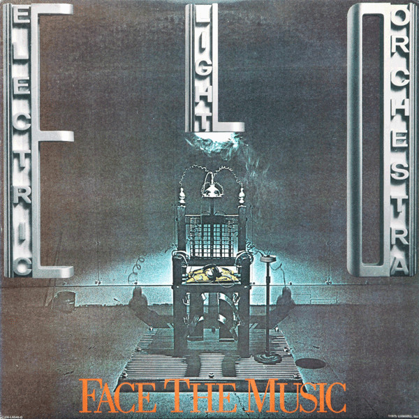

# Face The Music

By Electric Light Orchestra

## Album Data

[Discogs URL](https://www.discogs.com/release/5607994-Electric-Light-Orchestra-Face-The-Music)

- Label: United Artists Records
Jet Records
- Formats: Vinyl, LP, Album, Stereo
- Genres: Rock, Prog Rock, Pop Rock
- Rating: 3.83
- Released: 1975-09-00
- Year: 1975
- Release ID: 5607994
- Media condition: 
- Sleeve condition: 
- Speed: 
- Weight: 
- Notes: 

## Album Tracks

| **Position** | **Title** | **Duration** |
|--------------|-----------|--------------|
| A1 | **Fire On High** | 5:29 |
| A2 | **Waterfall** | 4:11 |
| A3 | **Evil Woman** | 4:34 |
| A4 | **Nightrider** | 4:22 |
| B1 | **Poker** | 3:30 |
| B2 | **Strange Magic** | 4:29 |
| B3 | **Down Home Town** | 3:53 |
| B4 | **One Summer Dream** | 5:45 |

## Artist Roles

| **Name** | **Role** |
|----------|----------|
| **Jeff Lynne** | Arranged By [Strings] |
| **Louis Clark** | Arranged By [Strings] |
| **Richard Tandy** | Arranged By [Strings] |
| **Kelly Groucutt** | Bass, Vocals, Backing Vocals |
| **Hugh McDowell** | Cello |
| **Melvyn Gale** | Cello |
| **John Kehe** | Design |
| **Mick Haggerty** | Design |
| **Bev Bevan** | Drums, Percussion, Backing Vocals |
| **Mack (2)** | Engineer |
| **Jeff Lynne** | Guitar, Vocals, Backing Vocals |
| **Norman Seeff** | Photography By [Back Cover] |
| **Fred Valentine** | Photography By [Cover & Inside Sleeve] |
| **Richard Tandy** | Piano, Synthesizer [Moog], Guitar, Clavinet |
| **Jeff Lynne** | Producer |
| **Mik Kaminski** | Violin |
| **Jeff Lynne** | Written-By |

