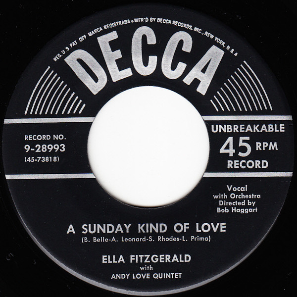

# A Sunday Kind Of Love / That's My Desire

By Ella Fitzgerald

## Album Data

[Discogs URL](https://www.discogs.com/release/8023163-Ella-Fitzgerald-With-The-Andy-Love-Quintet-A-Sunday-Kind-Of-Love-Thats-My-Desire)

- Label: Decca
- Formats: Vinyl, 7", 45 RPM, Single
- Genres: Jazz, Swing, Big Band
- Rating: 0
- Released: 1954-01-00
- Year: 0
- Release ID: 8023163
- Media condition: 
- Sleeve condition: 
- Speed: 
- Weight: 
- Notes: 

## Album Tracks

| **Position** | **Title** | **Duration** |
|--------------|-----------|--------------|
| A | **A Sunday Kind Of Love** | 3:24 |
| B | **That's My Desire** | 2:58 |

## Artist Roles

| **Name** | **Role** |
|----------|----------|
| **Bob Haggart And His Orchestra** | Orchestra |

