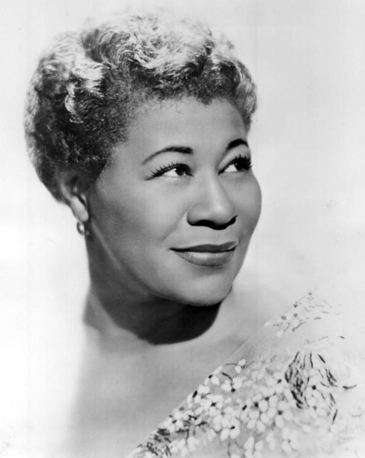

# Ella Fitzgerald

## Artist Profile

Born: 25 April 1917 in Newport News, Virginia, USA. 
Died: 15 June 1996 in Beverly Hills, California, USA (aged 79). 

Dubbed 'The First Lady Of Song', Ella Fitzgerald was the most popular female jazz singer in the US for more than half a century. In her lifetime, she won 13 Grammy awards and sold over 40 million albums. 

Mother of jazz pianist/singer Ray Brown Jr., ex-wife of jazz double-bassist Ray Brown. 

## Artist Links

- [http://www.ellafitzgerald.com](http://www.ellafitzgerald.com)
- [https://en.wikipedia.org/wiki/Ella_Fitzgerald](https://en.wikipedia.org/wiki/Ella_Fitzgerald)
- [https://www.britannica.com/biography/Ella-Fitzgerald](https://www.britannica.com/biography/Ella-Fitzgerald)
- [https://www.facebook.com/EllaFitzgerald/](https://www.facebook.com/EllaFitzgerald/)
- [https://www.allmusic.com/artist/ella-fitzgerald-mn0000184502](https://www.allmusic.com/artist/ella-fitzgerald-mn0000184502)
- [https://www.biography.com/musician/ella-fitzgerald](https://www.biography.com/musician/ella-fitzgerald)
- [https://www.jazzdisco.org/verve-records/discography-1959/](https://www.jazzdisco.org/verve-records/discography-1959/)
- [https://adp.library.ucsb.edu/index.php/mastertalent/detail/104118/Fitzgerald_Ella](https://adp.library.ucsb.edu/index.php/mastertalent/detail/104118/Fitzgerald_Ella)
- [https://www.imdb.com/name/nm0280228/](https://www.imdb.com/name/nm0280228/)

## See also

- [A Sunday Kind Of Love / That's My Desire](A_Sunday_Kind_Of_Love_-_Thats_My_Desire.md)
- [Melancholy Me / Somebody Bad Stole De Wedding Bell](Melancholy_Me_-_Somebody_Bad_Stole_De_Wedding_Bell.md)
