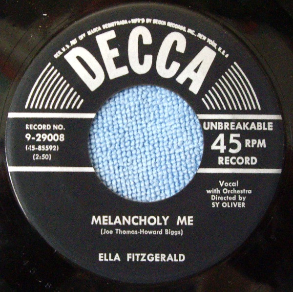

# Melancholy Me / Somebody Bad Stole De Wedding Bell

By Ella Fitzgerald

## Album Data

[Discogs URL](https://www.discogs.com/release/4572040-Ella-Fitzgerald-Melancholy-Me-Somebody-Bad-Stole-De-Wedding-Bell)

- Label: Decca
- Formats: Vinyl, 7", Single, 45 RPM
- Genres: Jazz
- Rating: 4.5
- Released: 1954
- Year: 1954
- Release ID: 4572040
- Media condition: 
- Sleeve condition: 
- Speed: 
- Weight: 
- Notes: 

## Album Tracks

| **Position** | **Title** | **Duration** |
|--------------|-----------|--------------|
| A | ** Melancholy Me** | 2:50 |
| B | **Somebody Bad Stole De Wedding Bell** | 2:26 |

## Artist Roles

| **Name** | **Role** |
|----------|----------|
| **Sy Oliver** | Directed By |

