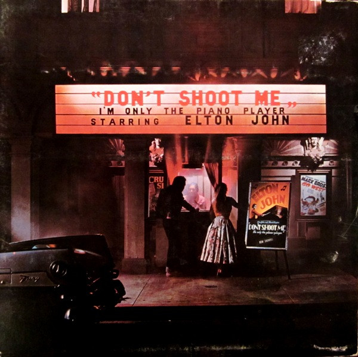

# Don't Shoot Me I'm Only The Piano Player

By Elton John

## Album Data

[Discogs URL](https://www.discogs.com/release/3299237-Elton-John-Dont-Shoot-Me-Im-Only-The-Piano-Player)

- Label: MCA Records
- Formats: Vinyl, LP, Album
- Genres: Rock, Pop Rock, Classic Rock
- Rating: 3.98
- Released: 1973
- Year: 1973
- Release ID: 3299237
- Media condition: 
- Sleeve condition: 
- Speed: 
- Weight: 
- Notes: 

## Album Tracks

| **Position** | **Title** | **Duration** |
|--------------|-----------|--------------|
| A1 | **Daniel** | 3:52 |
| A2 | **Teacher I Need You** | 4:08 |
| A3 | **Elderberry Wine** | 3:34 |
| A4 | **Blues For Baby And Me** | 5:38 |
| A5 | **Midnight Creeper** | 3:53 |
| B1 | **Have Mercy On The Criminal** | 5:55 |
| B2 | **I'm Going To Be A Teenage Idol** | 3:55 |
| B3 | **Texan Love Song** | 3:33 |
| B4 | **Crocodile Rock** | 3:56 |
| B5 | **High Flying Bird** | 4:10 |

## Artist Roles

| **Name** | **Role** |
|----------|----------|
| **Paul Buckmaster** | Arranged By [Orchestral Arrangements By] |
| **David Larkham** | Art Direction, Design [Sleeve] |
| **Michael Ross (3)** | Art Direction, Design [Sleeve] |
| **Stephen Brown (2)** | Coordinator |
| **Ken Scott** | Engineer |
| **Bernie Taupin** | Lyrics By |
| **Darrell Johnson** | Mastered By |
| **Elton John** | Performer [Starring] |
| **Davey Johnstone** | Performer [With] |
| **Dee Murray** | Performer [With] |
| **Nigel Olsson** | Performer [With] |
| **Ed Caraeff** | Photography By [Cover] |
| **Gus Dudgeon** | Producer |
| **Bernie Taupin** | Written-By |
| **Elton John** | Written-By |

