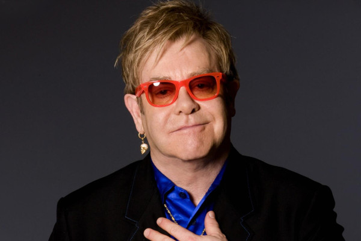

# Elton John

## Artist Profile

Note: Please use the entry Elton John &amp; Bernie Taupin when just the two of them are credited together.

English singer-songwriter, composer and pianist, born March 25, 1947, Pinner, Middlesex.
Elton John has been one of the dominant forces in rock and popular music, especially during the 1970s. He has sold over 200 million records, making him one of the most successful artists of all time. He has more than 50 Top 40 hits including seven consecutive No. 1 U.S. albums, 59 Top 40 singles, 16 Top 10, four No. 2 hits, and nine No. 1 hits. He has won five Grammy awards and two Academy Awards. His success has had a profound impact on popular music and has contributed to the continued popularity of the piano in rock and roll.

Inducted into Songwriters Hall of Fame in 1992 and Rock And Roll Hall of Fame in 1994 (as performer).

## Artist Links

- [https://www.eltonjohn.com/](https://www.eltonjohn.com/)
- [https://www.facebook.com/EltonJohn](https://www.facebook.com/EltonJohn)
- [https://myspace.com/eltonjohn](https://myspace.com/eltonjohn)
- [https://eltonjohn.tumblr.com/](https://eltonjohn.tumblr.com/)
- [https://twitter.com/eltonofficial](https://twitter.com/eltonofficial)
- [https://en.wikipedia.org/wiki/Elton_John](https://en.wikipedia.org/wiki/Elton_John)
- [https://www.britannica.com/biography/Elton-John](https://www.britannica.com/biography/Elton-John)
- [https://www.imdb.com/name/nm0005056/](https://www.imdb.com/name/nm0005056/)
- [https://www.youtube.com/eltonjohn](https://www.youtube.com/eltonjohn)
- [https://www.instagram.com/eltonjohn/](https://www.instagram.com/eltonjohn/)

## See also

- [Captain Fantastic And The Brown Dirt Cowboy](Captain_Fantastic_And_The_Brown_Dirt_Cowboy.md)
- [Don't Shoot Me I'm Only The Piano Player](Dont_Shoot_Me_Im_Only_The_Piano_Player.md)
- [Elton John](Elton_John.md)
- [Goodbye Yellow Brick Road](Goodbye_Yellow_Brick_Road.md)
- [Madman Across The Water](Madman_Across_The_Water.md)
