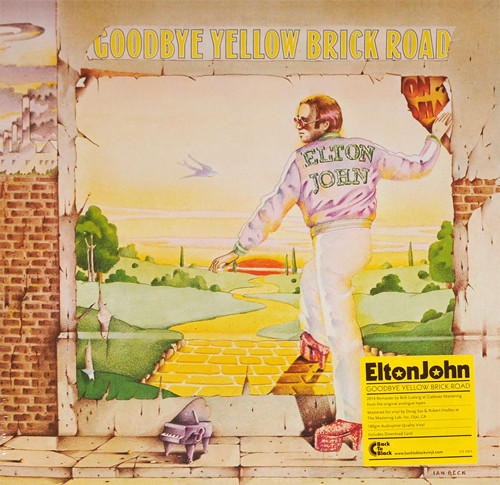

# Goodbye Yellow Brick Road

By Elton John

## Album Data

[Discogs URL](https://www.discogs.com/release/5532455-Elton-John-Goodbye-Yellow-Brick-Road)

- Label: Mercury
UMe
The Rocket Record Company
Universal UMC
- Formats: Vinyl, LP, Album, Misprint, Reissue, Remastered
- Genres: Rock, Pop Rock
- Rating: 4.62
- Released: 2014-03-24
- Year: 1973
- Release ID: 5532455
- Media condition: 
- Sleeve condition: 
- Speed: 
- Weight: 
- Notes: 

## Album Tracks

| **Position** | **Title** | **Duration** |
|--------------|-----------|--------------|
| A1 | **Funeral For A Friend [Love Lies Bleeding]** |  |
| A2 | **Candle In The Wind** |  |
| A3 | **Bennie And The Jets** |  |
| B1 | **Goodbye Yellow Brick Road** |  |
| B2 | **This Song Has No Title** |  |
| B3 | **Grey Seal** |  |
| B4 | **Jamaica Jerk-off** |  |
| B5 | **I've Seen That Movie Too** |  |
| C1 | **Sweet Painted Lady** |  |
| C2 | **The Ballad Of Danny Bailey [1909 - 34]** |  |
| C3 | **Dirty Little Girl** |  |
| C4 | **All The Girls Love Alice** |  |
| D1 | **Your Sister Can't Twist [But She Can Rock 'n' Roll]** |  |
| D2 | **Saturday Night's Alright For Fighting** |  |
| D3 | **Roy Rogers** |  |
| D4 | **Social Disease** |  |
| D5 | **Harmony** |  |

## Artist Roles

| **Name** | **Role** |
|----------|----------|
| **David Larkham** | Art Direction |
| **Michael Ross (3)** | Art Direction |
| **Stephen Brown (2)** | Coordinator |
| **David Hentschel** | Engineer |
| **Andy Scott (2)** | Engineer [Assistant] |
| **Peter Kelsey** | Engineer [Assistant] |
| **Ian Beck** | Illustration [Cover] |
| **Doug Sax** | Lacquer Cut By, Mastered By |
| **Robert Hadley** | Lacquer Cut By, Mastered By |
| **Del Newman** | Other [Orchestral Arrangement] |
| **Gus Dudgeon** | Producer |
| **Bob Ludwig** | Remastered By |
| **Elton John & Bernie Taupin** | Written By |

