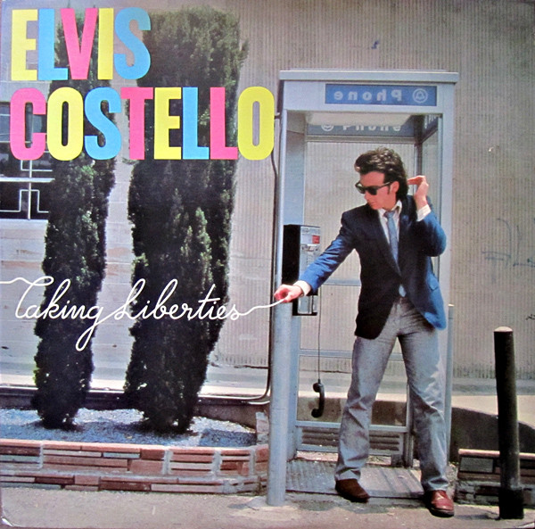

# Taking Liberties

By Elvis Costello

## Album Data

[Discogs URL](https://www.discogs.com/release/400441-Elvis-Costello-Taking-Liberties)

- Label: Columbia
- Formats: Vinyl, LP, Compilation
- Genres: Rock, New Wave, Rock & Roll
- Rating: 3.86
- Released: 1980
- Year: 1980
- Release ID: 400441
- Media condition: 
- Sleeve condition: 
- Speed: 
- Weight: 
- Notes: 

## Album Tracks

| **Position** | **Title** | **Duration** |
|--------------|-----------|--------------|
| A1 | **Clean Money** | 1:57 |
| A2 | **Girls Talk** | 1:56 |
| A3 | **Talking In The Dark** | 1:56 |
| A4 | **Radio Sweetheart** | 2:48 |
| A5 | **Black And White World** | 1:51 |
| A6 | **Big Tears** | 3:10 |
| A7 | **Just A Memory** | 2:14 |
| A8 | **Night Rally** | 2:40 |
| A9 | **Stranger In The House** | 3:01 |
| A10 | **Clowntime Is Over** | 3:39 |
| B1 | **Getting Mighty Crowded** | 2:05 |
| B2 | **Hoover Factory** | 1:43 |
| B3 | **Tiny Steps** | 2:42 |
| B4 | **(I Don't Want To Go To) Chelsea** | 3:05 |
| B5 | **Dr. Luther's Assistant** | 3:30 |
| B6 | **Sunday's Best** | 3:23 |
| B7 | **Crawling To The U.S.A.** | 2:52 |
| B8 | **Wednesday Week** | 2:02 |
| B9 | **My Funny Valentine** | 1:25 |
| B10 | **Ghost Train** | 3:05 |

## Artist Roles

| **Name** | **Role** |
|----------|----------|
| **The CBS Records Art Department** | Design |
| **Aldo Bocca** | Engineer |
| **Bassman (15)** | Engineer |
| **Bazza** | Engineer |
| **Chas Herington** | Engineer |
| **Guy Bidmead** | Engineer |
| **Roger Bechirian** | Engineer |
| **Gregg Geller** | Liner Notes |
| **Elvis Costello** | Producer |
| **Nick Lowe** | Producer |
| **Guy Bidmead** | Remix |
| **Elvis Costello** | Written-By |

