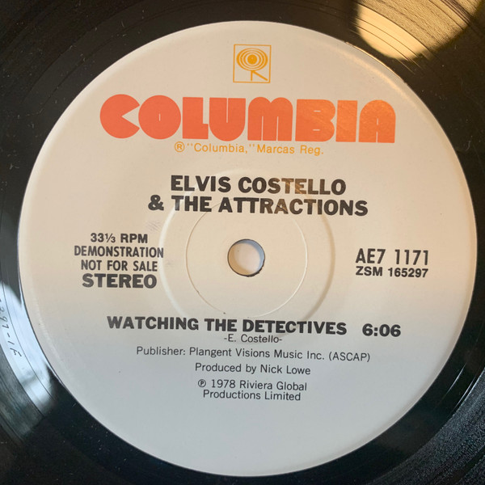

# Accidents Will Happen / Alison

By Elvis Costello & The Attractions

## Album Data

[Discogs URL](https://www.discogs.com/release/2656343-Elvis-Costello-The-Attractions-Accidents-Will-Happen-Alison)

- Label: Columbia
- Formats: Vinyl, 7", 33 ⅓ RPM, Promo, Stereo
- Genres: Rock, Pop Rock
- Rating: 4.23
- Released: 1979
- Year: 1979
- Release ID: 2656343
- Media condition: 
- Sleeve condition: 
- Speed: 
- Weight: 
- Notes: 

## Album Tracks

| **Position** | **Title** | **Duration** |
|--------------|-----------|--------------|
| A1 | **Accidents Will Happen** | 3:20 |
| A2 | **Alison** | 3:04 |
| B | **Watching The Detectives** | 6:06 |

## Artist Roles

| **Name** | **Role** |
|----------|----------|
| **Nick Lowe** | Producer |
| **Elvis Costello** | Written-By |

