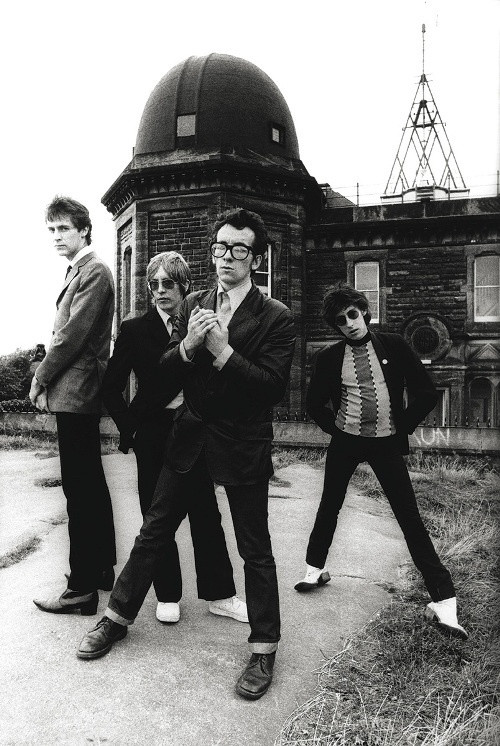

# Elvis Costello & The Attractions

## Artist Profile

Elvis Costello & The Attractions collaborated between 1978 and 1986, and again from 1994 through 1996. They consisted of Elvis Costello, Steve Nieve, Bruce Thomas, and Pete Thomas . 
In 2003, Elvis Costello & The Attractions were inducted into the Rock and Roll Hall of Fame.

## Artist Links

## See also

- [Accidents Will Happen / Alison](Accidents_Will_Happen_-_Alison.md)
- [Trust](Trust.md)
