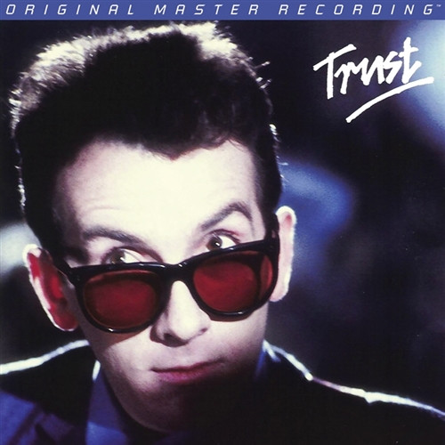

# Trust

By Elvis Costello & The Attractions

## Album Data

[Discogs URL](https://www.discogs.com/release/7543415-Elvis-Costello-And-The-Attractions-Trust)

- Label: Mobile Fidelity Sound Lab
- Formats: Vinyl, LP, Album, Limited Edition, Numbered, Reissue, Remastered, Stereo
- Genres: Rock, New Wave, Pop Rock
- Rating: 4.51
- Released: 2015
- Year: 1981
- Release ID: 7543415
- Media condition: 
- Sleeve condition: 
- Speed: 
- Weight: 
- Notes: 

## Album Tracks

| **Position** | **Title** | **Duration** |
|--------------|-----------|--------------|
| A1 | **Clubland** | 3:41 |
| A2 | **Lovers Walk** | 2:16 |
| A3 | **You'll Never Be A Man** | 2:56 |
| A4 | **Pretty Words** | 3:10 |
| A5 | **Strict Time** | 2:40 |
| A6 | **Luxembourg** | 2:27 |
| A7 | **Watch Your Step** | 2:59 |
| B1 | **New Lace Sleeves** | 3:45 |
| B2 | **From A Whisper To A Scream** | 2:53 |
| B3 | **Different Finger** | 1:58 |
| B4 | **White Knuckles** | 3:47 |
| B5 | **Shot With His Own Gun** | 3:29 |
| B6 | **Fish 'N' Chip Paper** | 2:55 |
| B7 | **Big Sister's Clothes** | 2:12 |

## Artist Roles

| **Name** | **Role** |
|----------|----------|
| **Krieg Wunderlich** | Lacquer Cut By |
| **Krieg Wunderlich** | Mastered By |
| **Nick Lowe** | Producer |
| **Neill King** | Producer [Assisted By] |
| **Roger Bechirian** | Producer [In Association With] |
| **Elvis Costello** | Written-By |

