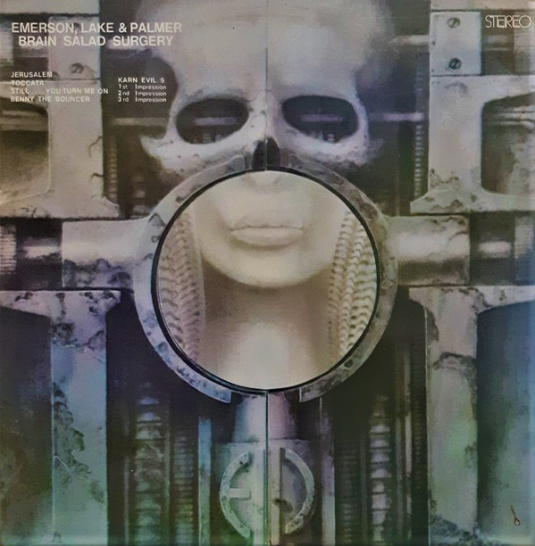

# Brain Salad Surgery

By Emerson, Lake & Palmer

## Album Data

[Discogs URL](https://www.discogs.com/release/5727270-Emerson-Lake-Palmer-Brain-Salad-Surgery)

- Label: Manticore
Manticore
- Formats: Vinyl, LP, Album
- Genres: Rock, Prog Rock, Classic Rock
- Rating: 4.06
- Released: 1973
- Year: 1973
- Release ID: 5727270
- Media condition: 
- Sleeve condition: 
- Speed: 
- Weight: 
- Notes: 

## Album Tracks

| **Position** | **Title** | **Duration** |
|--------------|-----------|--------------|
| A1 | **Jerusalem** |  |
| A2 | **Toccata** |  |
| A3 | **Still....You Turn Me On** |  |
| A4 | **Benny The Bouncer** |  |
|  | **Karn Evil 9** |  |
| A5 | **1st Impression - Part 1** |  |
| B1 | **1st Impression - Part 2** |  |
| B2 | **2nd Impression** |  |
| B3 | **3rd Impression** |  |

## Artist Roles

| **Name** | **Role** |
|----------|----------|
| **Chris Kimsey** | Engineer |
| **Geoff Young** | Engineer |
| **Keith Emerson** | Organ, Harpsichord, Accordion, Synthesizer |
| **HR Giger** | Painting [Cover Painting] |
| **Carl Palmer** | Percussion, Synthesizer [Percussion] |
| **Rosemary Adams** | Photography By |
| **Greg Lake** | Producer |
| **Greg Lake** | Vocals, Bass, Guitar [Zermatis Electric 6 String And 12 String] |

