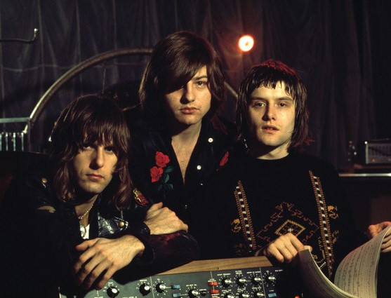

# Emerson, Lake & Palmer

## Artist Profile

Emerson, Lake & Palmer, also commonly referred to as ELP or EL&P, were a popular English progressive rock group formed by members of The Nice (Keith Emerson), King Crimson (Greg Lake) and Atomic Rooster (Carl Palmer). The band are notable for their classical and jazz influenced compositions, virtuoso musicianship and over-the-top live performances.

Formed: 1970. Disbanded: 1979.
Reformed: 1991. Disbanded 1998.
Reformed 2010.

## Artist Links

- [https://www.emersonlakepalmer.com/](https://www.emersonlakepalmer.com/)
- [https://en.wikipedia.org/wiki/Emerson,_Lake_%26_Palmer](https://en.wikipedia.org/wiki/Emerson,_Lake_%26_Palmer)
- [https://www.45cat.com/artist/emerson-lake-and-palmer](https://www.45cat.com/artist/emerson-lake-and-palmer)

## See also

- [Brain Salad Surgery](Brain_Salad_Surgery.md)
- [Emerson, Lake & Palmer](Emerson__Lake_and_Palmer.md)
- [Trilogy](Trilogy.md)
