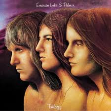

# Trilogy

By Emerson, Lake & Palmer

## Album Data

[Discogs URL](https://www.discogs.com/release/9193754-Emerson-Lake-Palmer-Trilogy)

- Label: BMG
Manticore
- Formats: Vinyl, LP, Album, Reissue, Remastered
- Genres: Rock, Symphonic Rock, Classic Rock, Prog Rock
- Rating: 4.6
- Released: 2016-09-30
- Year: 1972
- Release ID: 9193754
- Media condition: 
- Sleeve condition: 
- Speed: 
- Weight: 
- Notes: 

## Album Tracks

| **Position** | **Title** | **Duration** |
|--------------|-----------|--------------|
| A1 | **The Endless Enigma (Part One)** |  |
| A2 | **Fugue** |  |
| A3 | **The Endless Enigma (Part Two)** |  |
| A4 | **From The Beginning** |  |
| A5 | **The Sheriff** |  |
| A6 | **Hoedown** |  |
| B1 | **Trilogy** |  |
| B2 | **Living Sin** |  |
| B3 | **Abaddon's Bolero** |  |

## Artist Roles

| **Name** | **Role** |
|----------|----------|
| **Emerson, Lake & Palmer** | Arranged By |
| **Hugh Gilmour** | Artwork [2016 Re-Issue] |
| **Phil Crennell** | Artwork [Tinting By] |
| **Greg Lake** | Bass, Electric Guitar, Acoustic Guitar, Vocals |
| **Jon Wilson (3)** | Coordinator [Release] |
| **Steve Hammonds** | Coordinator [Release] |
| **Hipgnosis (2)** | Design [Cover], Photography By |
| **Eddy Offord** | Engineer [Production] |
| **Greg Moore (4)** | Lacquer Cut By |
| **Stewart Young** | Management |
| **Andy Pearce** | Mastered By [2015 Original Album Remaster] |
| **Matt Wortham** | Mastered By [2015 Original Album Remaster] |
| **Keith Emerson** | Organ [Hammond C3], Piano [Steinway], Zurna [Zoukra], Synthesizer [Moog III C], Synthesizer [Mini Moog Model D] |
| **Carl Palmer** | Other [Special Thanks To] |
| **Graham Lilley** | Other [Special Thanks To] |
| **Greg Lake** | Other [Special Thanks To] |
| **Jo Headland** | Other [Special Thanks To] |
| **Keith Emerson** | Other [Special Thanks To] |
| **Stewart Young** | Other [Special Thanks To] |
| **Carl Palmer** | Percussion |
| **Greg Lake** | Producer, Lyrics By |

