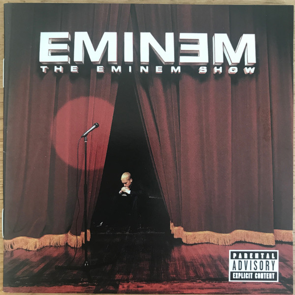

# The Eminem Show

By Eminem

## Album Data

[Discogs URL](https://www.discogs.com/release/7282012-Eminem-The-Eminem-Show)

- Label: Aftermath Entertainment
- Formats: Vinyl, LP, Album, Reissue, Stereo
- Genres: Hip Hop, Pop Rap
- Rating: 4.46
- Released: 2014-02-10
- Year: 2002
- Release ID: 7282012
- Media condition: 
- Sleeve condition: 
- Speed: 
- Weight: 
- Notes: 

## Album Tracks

| **Position** | **Title** | **Duration** |
|--------------|-----------|--------------|
| A1 | **Curtains Up (Skit)** | 0:29 |
| A2 | **White America** | 5:24 |
| A3 | **Business** | 4:11 |
| A4 | **Cleanin Out My Closet** | 4:57 |
| A5 | **Square Dance** | 5:23 |
| B1 | **The Kiss (Skit)** | 1:15 |
| B2 | **Soldier** | 3:46 |
| B3 | **Say Goodbye Hollywood** | 4:32 |
| B4 | **Drips** | 4:45 |
| B5 | **Without Me** | 4:50 |
| C1 | **Paul Rosenberg (Skit)** | 0:22 |
| C2 | **Sing For The Moment** | 5:39 |
| C3 | **Superman** | 5:50 |
| C4 | **Hailie's Song** | 5:20 |
| D1 | **Steve Berman (Skit)** | 0:33 |
| D2 | **When The Music Stops** | 4:29 |
| D3 | **Say What You Say** | 5:09 |
| D4 | **Till I Collapse** | 4:57 |
| D5 | **My Dad's Gone Crazy** | 4:27 |
| D6 | **Curtains Close (Skit)** | 1:01 |

## Artist Roles

| **Name** | **Role** |
|----------|----------|
| **DJ Mormile** | A&R [Interscope] |
| **Marc Labelle (2)** | A&R [Shady Records] |
| **Jason Noto** | Art Direction, Design |
| **Jeff Bass** | Bass |
| **Mike Elizondo** | Bass |
| **Jeff Bass** | Co-producer |
| **Kirdis Tucker** | Coordinator [Aftermath Project Coordinator] |
| **Larry Chatman** | Coordinator [Aftermath Project Coordinator] |
| **Les Scurry** | Coordinator [Interscope Production Coordination] |
| **Sarah Catlett** | Coordinator [Studio A&r Coordination For 54sound] |
| **Alex Reverberi** | Engineer [Assistant] |
| **James McCrone** | Engineer [Assistant] |
| **Mike Strange** | Engineer [Assistant] |
| **Urban Kris** | Engineer [Assistant] |
| **Mauricio "Veto" Iragorri** | Engineer [Recording] |
| **Steve King** | Engineer [Recording] |
| **Dr. Dre** | Executive-Producer |
| **Jeff Bass** | Executive-Producer [For F.B.T. Productions] |
| **Mark Bass** | Executive-Producer [For F.B.T. Productions] |
| **Jeff Bass** | Guitar |
| **Jeff Bass** | Keyboards |
| **Mike Elizondo** | Keyboards |
| **Ron "NEFF-U" Feemstar** | Keyboards |
| **Paul Rosenberg** | Management |
| **Joel Martin (8)** | Management [F.b.t. Productions] |
| **Chris Clancy (2)** | Management [Interscope Product Management] |
| **Brian Gardner** | Mastered By |
| **Dr. Dre** | Mixed By |
| **Steve King** | Mixed By |
| **Jonathan Mannion** | Photography By |
| **Dr. Dre** | Producer |
| **Eminem** | Producer |
| **Steve King** | Recorded By |
| **Kevin Dresser** | Typography [Typeface Based On Eminem's Handwriting] |
| **Andre Young** | Written-By |
| **Anne Dudley** | Written-By |
| **Denaun Porter** | Written-By |
| **Jeff Bass** | Written-By |
| **Kevin Bell (4)** | Written-By |
| **Luis Resto** | Written-By |
| **Malcolm McLaren** | Written-By |
| **Marshall Mathers** | Written-By |
| **Mike Elizondo** | Written-By |
| **Nathaniel Hale** | Written-By |
| **Obie Trice** | Written-By |
| **Ondre Moore** | Written-By |
| **Ron "NEFF-U" Feemstar** | Written-By |
| **Rufus Johnson** | Written-By |
| **Steve King** | Written-By |
| **Steven Tyler** | Written-By |
| **Trevor Horn** | Written-By |
| **Von Carlisle** | Written-By |

