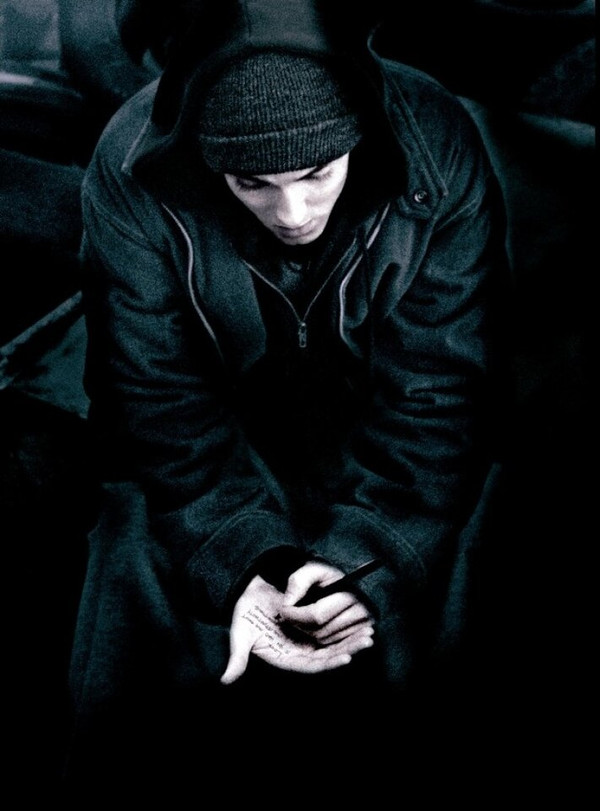

# Eminem

## Artist Profile

Marshall Bruce Mathers III (born October 17, 1972, St. Joseph, Missouri), known by his primary stage name Eminem (stylized as EMINƎM), or by his alter ego Slim Shady, is an American rapper and record producer who grew up in Detroit, Michigan. He began his professional music career as a member of Soul Intent along with Proof in 1992. He also started his first record label with his group that same year called Mashin' Duck Records.

## Artist Links

- [https://www.eminem.com/](https://www.eminem.com/)
- [https://www.instagram.com/eminem](https://www.instagram.com/eminem)
- [https://twitter.com/Eminem](https://twitter.com/Eminem)
- [https://www.facebook.com/eminem](https://www.facebook.com/eminem)
- [https://www.imdb.com/name/nm0004896/](https://www.imdb.com/name/nm0004896/)
- [https://myspace.com/eminem](https://myspace.com/eminem)
- [https://www.youtube.com/user/EminemMusic](https://www.youtube.com/user/EminemMusic)
- [https://www.youtube.com/user/EminemVEVO](https://www.youtube.com/user/EminemVEVO)
- [https://eminem.tumblr.com/](https://eminem.tumblr.com/)
- [https://en.wikipedia.org/wiki/Eminem](https://en.wikipedia.org/wiki/Eminem)
- [https://equipboard.com/pros/eminem](https://equipboard.com/pros/eminem)
- [https://genius.com/eminem](https://genius.com/eminem)

## See also

- [The Eminem Show](The_Eminem_Show.md)
