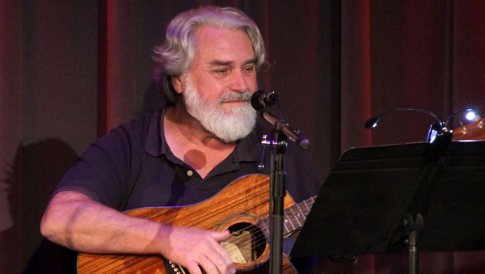

# Emitt Rhodes

## Artist Profile

American multi-instrumentalist and singer, born on February 25, 1950, in Hawthorne, California. Died on July 19, 2020.
In the '60s he played drums for a number of groups (The Palace Guard among them) before founding The Merry-Go-Round in 1967.
Between 1970 and 1973 he released four solo albums; writing, producing, and playing every instrument on three of them (Emitt Rhodes / Mirror / Farewell To Paradise).

## Artist Links

- [https://en.wikipedia.org/wiki/Emitt_Rhodes](https://en.wikipedia.org/wiki/Emitt_Rhodes)
- [http://www.emittrhodesmusic.net](http://www.emittrhodesmusic.net)
- [http://www.myspace.com/emittrhodesrules](http://www.myspace.com/emittrhodesrules)

## See also

- [How Can You Mend A Broken Heart / Please Read Me](How_Can_You_Mend_A_Broken_Heart_-_Please_Read_Me.md)
