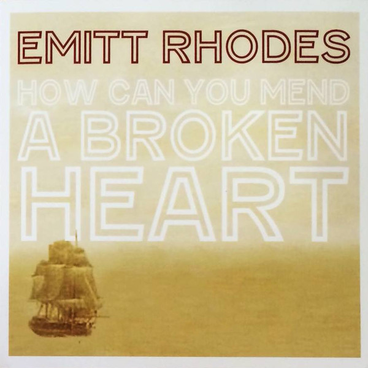

# How Can You Mend A Broken Heart / Please Read Me

By Emitt Rhodes

## Album Data

[Discogs URL](https://www.discogs.com/release/6891395-Emitt-Rhodes-Chris-Price-How-Can-You-Mend-A-Broken-Heart-Please-Read-Me)

- Label: 80 Proof Records & Tapes
- Formats: Vinyl, 7", 45 RPM, Single, Limited Edition
- Genres: Rock, Pop, Power Pop, Rock & Roll
- Rating: 4
- Released: 2015-04-18
- Year: 2015
- Release ID: 6891395
- Media condition: 
- Sleeve condition: 
- Speed: 
- Weight: 
- Notes: 

## Album Tracks

| **Position** | **Title** | **Duration** |
|--------------|-----------|--------------|
| A | **How Can You Mend A Broken Heart** | 3:13 |
| B | **Please Read Me** | 2:02 |

## Artist Roles

| **Name** | **Role** |
|----------|----------|
| **Barry Gibb** | Written-By |
| **Robin Gibb** | Written-By |

