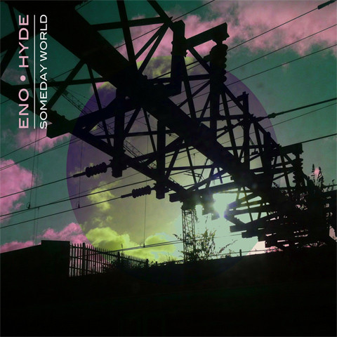

# Someday World

By Eno • Hyde

## Album Data

[Discogs URL](https://www.discogs.com/release/5701699-Eno-Hyde-Someday-World)

- Label: Warp Records
Opal Records
- Formats: Vinyl, LP, Album
- Genres: Electronic, Synth-pop
- Rating: 4.21
- Released: 2014-05-02
- Year: 2014
- Release ID: 5701699
- Media condition: 
- Sleeve condition: 
- Speed: 
- Weight: 
- Notes: 

## Album Tracks

| **Position** | **Title** | **Duration** |
|--------------|-----------|--------------|
| A1 | **The Satellites** | 5:33 |
| A2 | **Daddy's Car** | 4:51 |
| B1 | **A Man Wakes Up** | 4:19 |
| B2 | **Witness** | 5:08 |
| B3 | **Strip It Down** | 4:44 |
| C1 | **Mother Of A Dog** | 5:38 |
| C2 | **Who Rings The Bell** | 5:05 |
| D1 | **When I Built This World** | 5:47 |
| D2 | **To Us All** | 3:27 |

## Artist Roles

| **Name** | **Role** |
|----------|----------|
| **Brian Eno** | Composed By |
| **Fred Gibson (2)** | Composed By |
| **Karl Hyde** | Composed By |
| **Brian Eno** | Cover |
| **Nick Robertson (4)** | Design [Photographic Treatments] |
| **Kevin Metcalfe** | Mastered By |
| **Tessa Angus** | Photography By [Additional] |
| **Karl Hyde** | Photography By [Front Cover], Photography By [Electricity Shots] |
| **Brian Eno** | Producer |
| **Fred Gibson (2)** | Producer |

