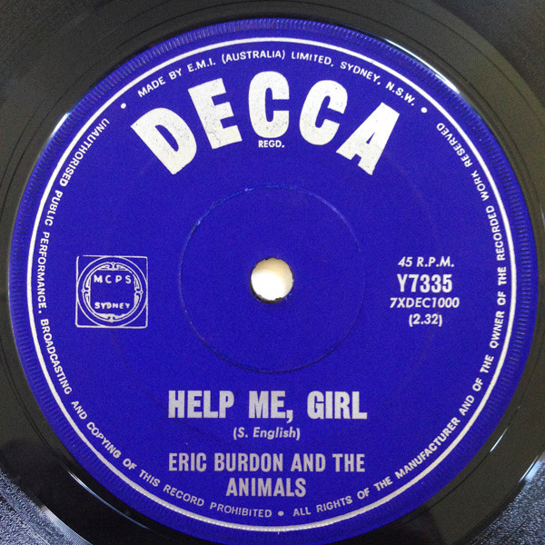

# Help Me Girl

By Eric Burdon & The Animals

## Album Data

[Discogs URL](https://www.discogs.com/release/3386868-Eric-Burdon-And-The-Animals-Help-Me-Girl)

- Label: MGM Records
- Formats: Vinyl, 7", 45 RPM, Single
- Genres: Rock, Psychedelic Rock
- Rating: 4
- Released: 1966
- Year: 1966
- Release ID: 3386868
- Media condition: 
- Sleeve condition: 
- Speed: 
- Weight: 
- Notes: 

## Album Tracks

| **Position** | **Title** | **Duration** |
|--------------|-----------|--------------|
| A | **Help Me Girl** | 2:35 |
| B | **That Ain't Where It's At** | 2:55 |

## Artist Roles

| **Name** | **Role** |
|----------|----------|
| **Horace Ott** | Arranged By, Conductor |
| **Tom Wilson (2)** | Producer |

