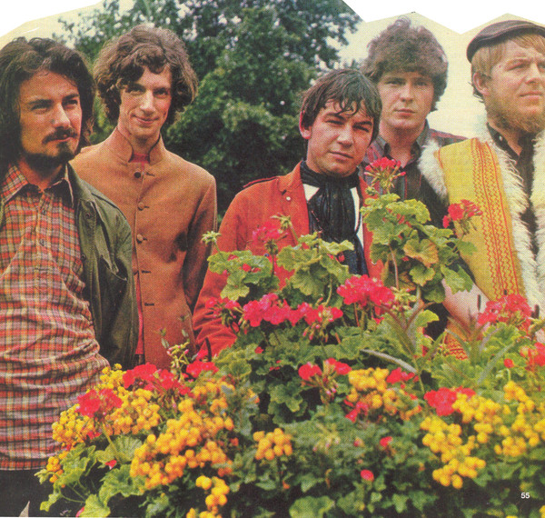

# Eric Burdon & The Animals

## Artist Profile

Formed in 1966 by Eric Burdon after the break-up of the "original" Animals (see The Animals). Some of the early tracks credited to Eric Burdon & The Animals had actually been recorded by The Animals (including "Don't Bring Me Down", "See See Rider", "She'll Return It"). Also known as Eric Burdon & The New Animals.

## Artist Links

## See also

- [Help Me Girl](Help_Me_Girl.md)
- [Monterey](Monterey.md)
