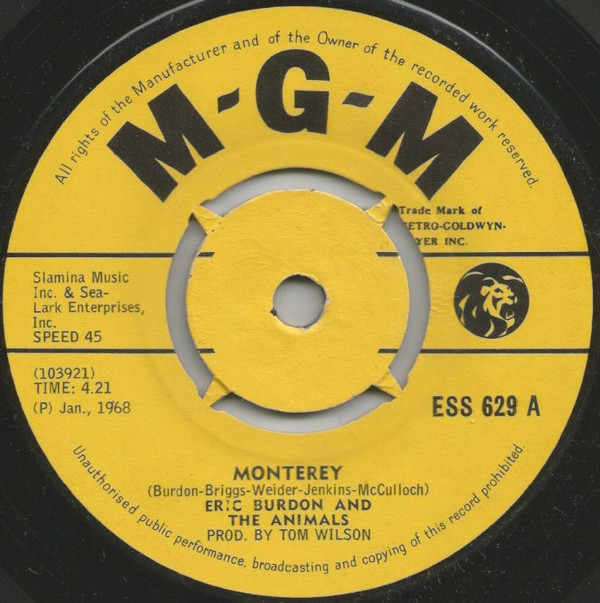

# Monterey

By Eric Burdon & The Animals

## Album Data

[Discogs URL](https://www.discogs.com/release/2726526-Eric-Burdon-And-The-Animals-Monterey)

- Label: MGM Records
MGM Records
- Formats: Vinyl, 7", 45 RPM, Single
- Genres: Rock, Psychedelic Rock
- Rating: 4.56
- Released: 1967-12-00
- Year: 1967
- Release ID: 2726526
- Media condition: 
- Sleeve condition: 
- Speed: 
- Weight: 
- Notes: 

## Album Tracks

| **Position** | **Title** | **Duration** |
|--------------|-----------|--------------|
| A | **Monterey** | 4:21 |
| B | **Ain't That So** | 3:20 |

## Artist Roles

| **Name** | **Role** |
|----------|----------|
| **Tom Wilson (2)** | Producer |
| **Barry Jenkins** | Written-By |
| **Danny McCulloch** | Written-By |
| **Eric Burdon** | Written-By |
| **John Weider** | Written-By |
| **Victor Briggs** | Written-By |

