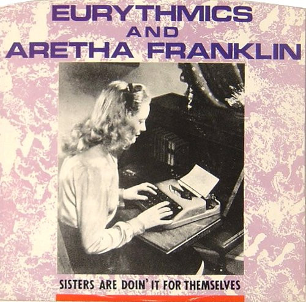

# Sisters Are Doin' It For Themselves

By Eurythmics

## Album Data

[Discogs URL](https://www.discogs.com/release/573862-Eurythmics-And-Aretha-Franklin-Sisters-Are-Doin-It-For-Themselves)

- Label: RCA
- Formats: Vinyl, 7", 45 RPM, Single
- Genres: Electronic, Funk / Soul, Pop, Synth-pop, Soul
- Rating: 3.42
- Released: 1985
- Year: 1985
- Release ID: 573862
- Media condition: 
- Sleeve condition: 
- Speed: 
- Weight: 
- Notes: 

## Album Tracks

| **Position** | **Title** | **Duration** |
|--------------|-----------|--------------|
| A | **Sisters Are Doin' It For Themselves (Edited Version)** | 4:29 |
| B | **I Love You Like A Ball And Chain** | 4:04 |

## Artist Roles

| **Name** | **Role** |
|----------|----------|
| **Adam Williams** | Engineer |
| **Jay Willis** | Engineer [Assistant] |
| **David A. Stewart** | Mixed By |
| **Don Smith** | Mixed By |
| **David A. Stewart** | Producer |
| **Annie Lennox** | Written-By |
| **David A. Stewart** | Written-By |

