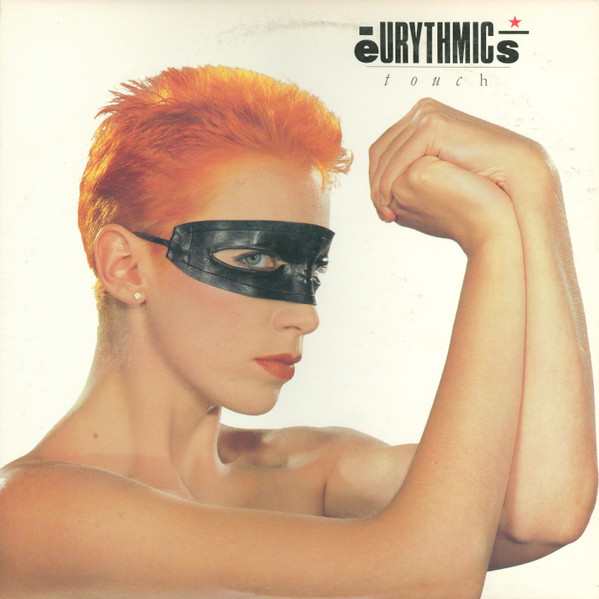

# Touch

By Eurythmics

## Album Data

[Discogs URL](https://www.discogs.com/release/1014022-Eurythmics-Touch)

- Label: RCA
RCA Victor
- Formats: Vinyl, LP, Album, Stereo
- Genres: Electronic, Synth-pop
- Rating: 3.93
- Released: 1984-01-00
- Year: 1983
- Release ID: 1014022
- Media condition: 
- Sleeve condition: 
- Speed: 
- Weight: 
- Notes: 

## Album Tracks

| **Position** | **Title** | **Duration** |
|--------------|-----------|--------------|
| A1 | **Here Comes The Rain Again** | 4:54 |
| A2 | **Regrets** | 4:43 |
| A3 | **Right By Your Side** | 4:05 |
| A4 | **Cool Blue** | 4:48 |
| A5 | **Who's That Girl?** | 4:46 |
| B1 | **The First Cut** | 4:44 |
| B2 | **Aqua** | 4:36 |
| B3 | **No Fear, No Hate, No Pain (No Broken Hearts)** | 5:24 |
| B4 | **Paint A Rumour** | 7:30 |

## Artist Roles

| **Name** | **Role** |
|----------|----------|
| **Michael Kamen** | Arranged By [Strings Arranged], Conductor [Strings Conducted By] |
| **Andrew Christian** | Artwork [Art, With Thanks To], Design [With Thanks To] |
| **Laurence Stevens** | Artwork [Art], Design |
| **The Croquettes** | Band [Eurythmics Live], Backing Vocals |
| **Gill O'Donovan** | Band [Eurythmics Live], Backing Vocals [The Croquettes] |
| **Maggie Ryder** | Band [Eurythmics Live], Backing Vocals [The Croquettes] |
| **Suzie O'List** | Band [Eurythmics Live], Backing Vocals [The Croquettes] |
| **Dean Garcia** | Band [Eurythmics Live], Bass |
| **Pete Phipps** | Band [Eurythmics Live], Drums |
| **Dick Cuthell** | Band [Eurythmics Live], Horns |
| **Martin Dobson** | Band [Eurythmics Live], Horns |
| **Vic Martin** | Band [Eurythmics Live], Synth [Synths] |
| **Martin Dobson** | Baritone Saxophone [Baritone Sax] |
| **Dean Garcia** | Bass Guitar |
| **Jon Bavin** | Engineer |
| **David A. Stewart** | Guitar, Keyboards, Dulcimer, Xylophone, Backing Vocals, Sequencer [Drum And Synthesizer Sequencers] |
| **Dick Cuthell** | Horns, Trumpet, Flugelhorn [Flugel Horn], Cornet |
| **Jack Adelman** | Lacquer Cut By |
| **Annie Lennox** | Lead Vocals [All Lead Vocals], Backing Vocals, Keyboards, Flute |
| **Kenny Smith (6)** | Management |
| **Gary Kurfirst** | Management [Management (USA)] |
| **Karen Ciccone** | Management [Personal Assistant] |
| **Brian Aris** | Photography By [Inner Sleeve] |
| **Peter Ashworth** | Photography By [Outer Sleeve] |
| **David A. Stewart** | Producer |
| **Annie Lennox** | Songwriter, Arranged By |
| **David A. Stewart** | Songwriter, Arranged By |
| **The British Philharmonic Orchestra** | Strings [Strings Appear Courtesy Of] |
| **Annie Lennox** | Written-By |
| **David A. Stewart** | Written-By |

