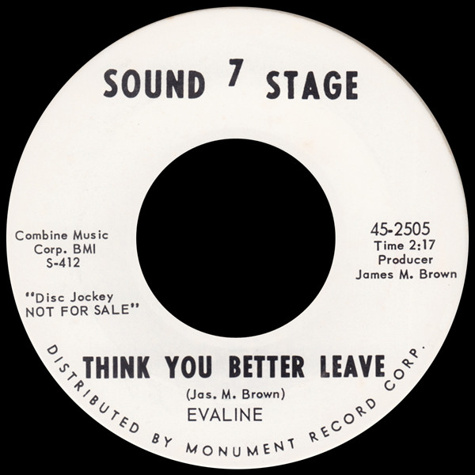

# Think You Better Leave

By Evaline Braden

## Album Data

[Discogs URL](https://www.discogs.com/release/6057834-Evaline-Think-You-Better-Leave)

- Label: Sound Stage 7
- Formats: Vinyl, 7", 45 RPM, Single, Promo
- Genres: Funk / Soul, Soul
- Rating: 4.33
- Released: 1963
- Year: 1963
- Release ID: 6057834
- Media condition: 
- Sleeve condition: 
- Speed: 
- Weight: 
- Notes: 

## Album Tracks

| **Position** | **Title** | **Duration** |
|--------------|-----------|--------------|
| A | **Think You Better Leave** | 2:17 |
| B | **Half** | 2:22 |

## Artist Roles

| **Name** | **Role** |
|----------|----------|
| **James Monroe Brown** | Producer |

