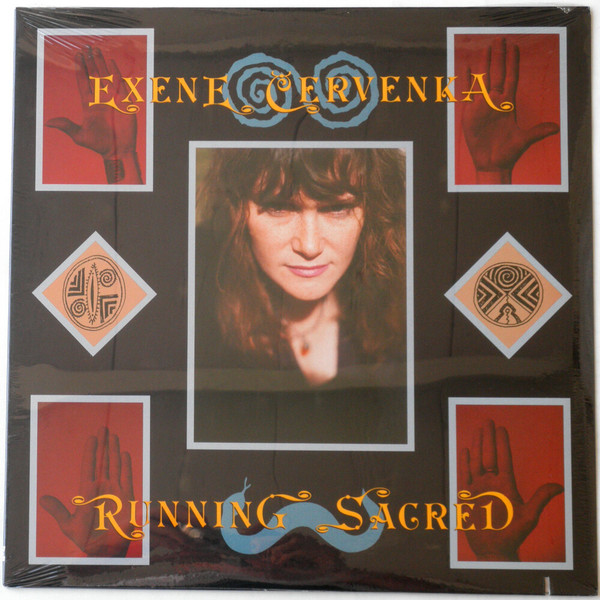

# Running Sacred

By Exene Cervenka

## Album Data

[Discogs URL](https://www.discogs.com/release/2539711-Exene-Cervenka-Running-Sacred)

- Label: R.N.A. Rhino New Artists
R.N.A. Rhino New Artists
- Formats: Vinyl, LP, Album
- Genres: Rock, Pop, Alternative Rock, Avantgarde
- Rating: 3.36
- Released: 1990
- Year: 1990
- Release ID: 2539711
- Media condition: 
- Sleeve condition: 
- Speed: 
- Weight: 
- Notes: 

## Album Tracks

| **Position** | **Title** | **Duration** |
|--------------|-----------|--------------|
| A1 | **Slave Labor** |  |
| A2 | **Clinic** |  |
| A3 | **Red Dirt** |  |
| A4 | **Real Estate** |  |
| A5 | **Curtains** |  |
| A6 | **A Boy And His Sister** |  |
| B1 | **Same Denomination** |  |
| B2 | **Missing Nature** |  |
| B3 | **It Fell** |  |
| B4 | **The Ballad Of Roberta** |  |
| B5 | **Just Another Perfect Day** |  |
| B6 | **Will Jesus Wash The Bloodstains From Your Hands** |  |

## Artist Roles

| **Name** | **Role** |
|----------|----------|
| **Geoff Gans** | Art Direction |
| **Exene Cervenka** | Artwork [Drawings And Writings] |
| **David McLees** | Coordinator [Project Assistance/coordination] |
| **Jan Davis** | Coordinator [Project Assistance/coordination] |
| **Elaine Anderson** | Engineer [Mixing Assistant] |
| **Russell Anderson** | Engineer [Record Assistant] |
| **Arturo Gerst** | Featuring |
| **Danny Krieger** | Featuring |
| **Duke McVinnie** | Featuring |
| **Eliza Gilkyson** | Featuring |
| **Jim Christie** | Featuring |
| **John Doe (2)** | Featuring |
| **Jon Dee Graham** | Featuring |
| **Julie Christensen** | Featuring |
| **Ken Stange** | Featuring |
| **Tony Gilkyson** | Featuring |
| **Will MacGregor** | Featuring |
| **Bernie Grundman** | Mastered By |
| **Viggo Mortensen** | Photography By |
| **Tony Gilkyson** | Producer |
| **Tom McCauley** | Recorded By, Mixed By |

