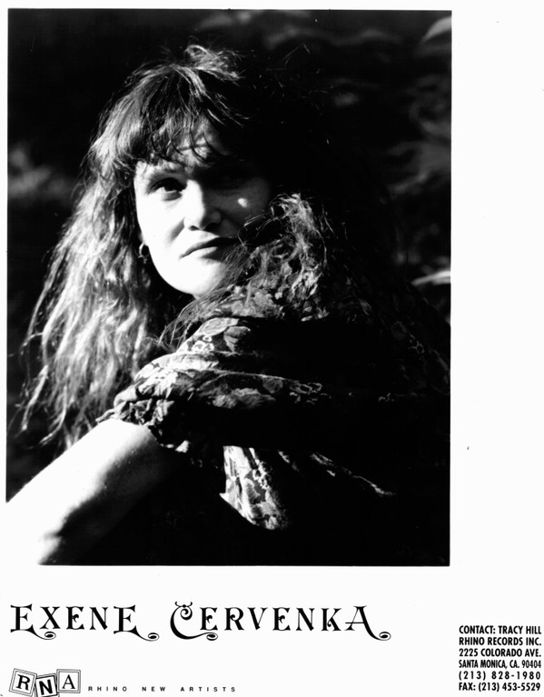

# Exene Cervenka

## Artist Profile

American writer, artist and musician, born 1 February 1956 in Chicago, Illinois, USA, best known as co-lead vocalist for punk band X (5). She was married to Viggo Mortensen from 1987 to 1998. Together, they had a son, Henry Mortensen.

## Artist Links

- [http://www.exenecervenka.com/](http://www.exenecervenka.com/)
- [http://www.myspace.com/exenecervenka](http://www.myspace.com/exenecervenka)
- [http://en.wikipedia.org/wiki/Exene_Cervenka](http://en.wikipedia.org/wiki/Exene_Cervenka)

## See also

- [Running Sacred](Running_Sacred.md)
